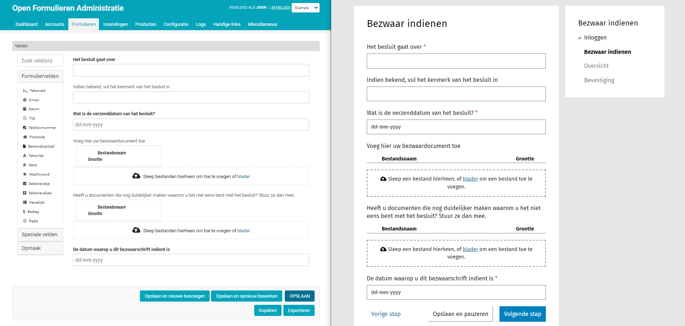

==========
Open Forms
==========

:Version: 3.1.4
:Source: https://github.com/open-formulieren/open-forms
:Keywords: e-Formulieren, Common Ground, FormIO, API

|docs| |docker|

Easily create and publish smart forms (`Nederlandse versie`_)

Developed by `Maykin Media B.V.`_, commissioned by `Dimpact`_.

Introduction
============

Using Open Forms, administrators can quickly create powerful and smart forms
that are exposed via an API. With the Open Forms JavaScript `SDK`_, personalized
forms can be retrieved and shown to the user. The form blends in with an
existing website using various styling options. Form fields are pre-filled
whenever possible and personalized choices are shown depending on the user, if
authenticated.

Using a plugin-based architecture, Open Forms allows for flexible submission
backends (e.g. `Open Zaak`_), authentication schemes, payment providers, calendar
apps and pre-fill services.

Open Forms is developed in line with the `Common Ground`_ principles,
with many plugins for government usage and with a strong focus on usability for
both end users and administrators.

.. _`SDK`: https://github.com/open-formulieren/open-forms-sdk/
.. _`Common Ground`: https://commonground.nl/
.. _`Open Zaak`: https://open-zaak.readthedocs.io/

Component
=========

|build-status| |coverage| |code-quality| |black| |python-versions|

This component includes the **Open Forms Admin UI** and the **Open Forms API**.

API Specifications
------------------

These can be found in the `documentation <https://open-forms.readthedocs.io/en/latest/developers/versioning.html#open-forms-api>`_

References
==========

* `Documentation <https://open-forms.readthedocs.io/>`_
* `Community <https://commonground.nl/groups/view/0c79b387-4567-4522-bc35-7d3583978c9f/open-forms>`_
* `Docker image <https://hub.docker.com/r/openformulieren/open-forms>`_
* `Issues <https://github.com/open-formulieren/open-forms/issues>`_
* `Code <https://github.com/open-formulieren/open-forms>`_
* `Open Forms SDK <https://github.com/open-formulieren/open-forms-sdk>`_

Licence
=======

Copyright © `Dimpact`_, 2021

Licensed under the `EUPL`_.

.. _`Nederlandse versie`: README.NL.rst
.. _`Maykin Media B.V.`: https://www.maykinmedia.nl
.. _`Dimpact`: https://www.dimpact.nl
.. _`EUPL`: LICENSE.md

.. |build-status| image:: https://github.com/open-formulieren/open-forms/actions/workflows/ci.yml/badge.svg
    :alt: Build status
    :target: https://github.com/open-formulieren/open-forms/actions/workflows/ci.yml

.. |code-quality| image:: https://github.com/open-formulieren/open-forms/actions//workflows/code_quality.yml/badge.svg
    :alt: Code quality checks
    :target: https://github.com/open-formulieren/open-forms/actions//workflows/code_quality.yml

.. |docs| image:: https://readthedocs.org/projects/open-forms/badge/?version=latest
    :target: https://open-forms.readthedocs.io/en/latest/?badge=latest
    :alt: Documentation status

.. |coverage| image:: https://codecov.io/github/open-formulieren/open-forms/branch/master/graphs/badge.svg?branch=master
    :alt: Coverage
    :target: https://codecov.io/gh/open-formulieren/open-forms

.. |black| image:: https://img.shields.io/badge/code%20style-black-000000.svg
    :alt: Code style
    :target: https://github.com/psf/black

.. |docker| image:: https://img.shields.io/docker/v/openformulieren/open-forms?sort=semver
    :alt: Docker image
    :target: https://hub.docker.com/r/openformulieren/open-forms

.. |python-versions| image:: https://img.shields.io/badge/python-3.12-blue.svg
    :alt: Supported Python versions
