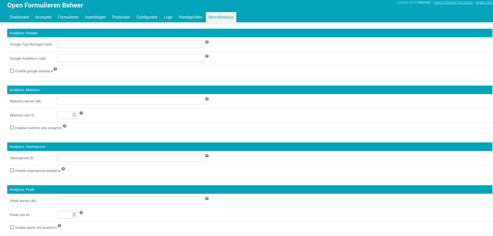

.. _configuration_general_analytics:

Analytics
=========

By default, Open Forms does not enable any form of external data analytics
tools. However, you can enable these tools within Open Forms. Below, we list
the integration possibilities within Open Forms.

.. warning::

    If you enable external data analytics tools, you **need** to set up a proper
    :ref:`cookie policy <configuration_general_cookies>` in accordance with
    the `GDPR`_ and your local privacy authority.

    Also, these data analytics tools will **only work** if the user allowed
    these cookies. If you do not set up cookies, these tools will simply not
    work because the user never allowed their cookies.

.. _`GDPR`: https://gdpr.eu/

Supported tools
---------------

The following tools are supported out of the box with Open Forms.

* `Google Analytics <https://marketingplatform.google.com/about/analytics/>`__
* `Google Tag Manager <https://marketingplatform.google.com/about/tag-manager/>`__
* `Matomo (Piwik) <https://matomo.org/>`__ (cloud and on-premise support)
* `Piwik PRO  <https://piwikpro.nl/>`__
* `SiteImprove <https://siteimprove.com/en/analytics/>`__
* `KLANTINFOCUS (GovMetric CX) <https://www.klantinfocus.nl/>`__

.. note::

    Matomo was formerly known as Piwik. Do not confuse Piwik with Piwik PRO,
    which is a different product from a different company.

Configuration
-------------

1. Please make sure there's an analytics cookie group available. You can check
   or configure this via :ref:`configure_cookies`.

2. Navigate to **Configuration** > **Analytics tools configuration**.

3. In **Analytics cookie consent group** select the appropriate *cookie group*
   configured in step 1.

    .. warning::

       If you don't do this, the data analytics tools will not work!

5. Configure one of the supported data analytics tools.

    .. note::
        Cookies and Content-Security-Policy will be set up automatically by providing
        the information needed for the specific data analytics tool and activate it.

6. Scroll to the bottom and click **Save**.

Vendor-specific notes
---------------------

Piwik Pro
~~~~~~~~~

Piwik Pro has a feature called
`debug mode <https://help.piwik.pro/support/tag-manager/debug-mode/>`_. Open Forms
supports this, provided that you manage the `Cross-Origin-Opener-Policy` header. There
are two options for this:

* Disabling it temporarily with a browser extension (preferred)
* Deploying Open Forms with the ``CROSS_ORIGIN_OPENER_POLICY=unsafe-none``
  :ref:`environment variable <installation_environment_config>`.
