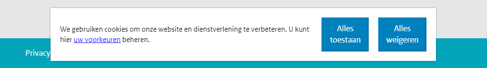
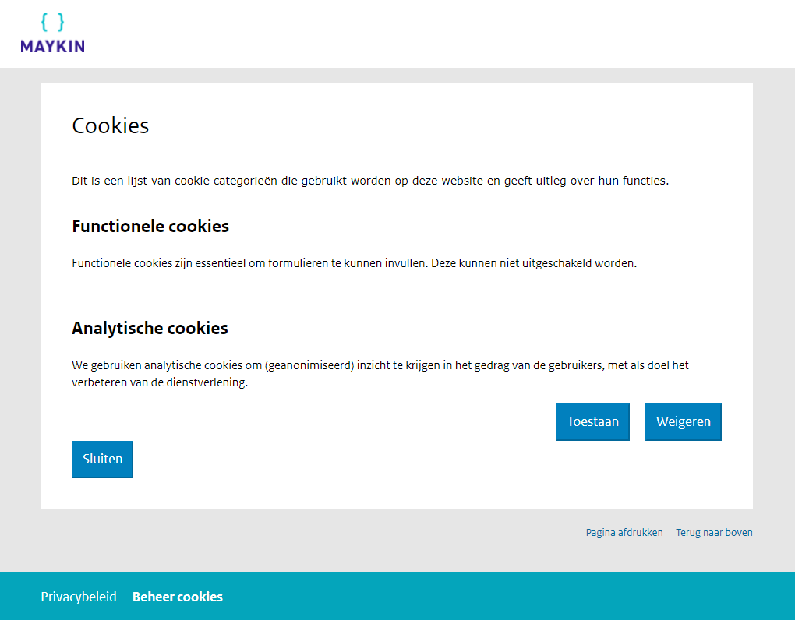

.. _configuration_general_cookies:

Privacy and cookies
===================

By default, Open Forms only uses (first party) `strictly necessary cookies`_ 
(although sometimes confusingly called "functionality cookies"). These cookies 
are needed to make Open Forms work: the browser has to remember which form 
someone is currently filling out and whether you are authenticated or not.

For this purpose, Open Forms does not require consent according to the `GDPR`_
(although local laws may differ in this aspect). You are encouraged to at least 
add a link to your privacy policy to explain why these cookies are required.

.. _`strictly necessary cookies`: https://gdpr.eu/cookies/
.. _`GDPR`: https://gdpr.eu/

Pivacy related settings
-----------------------

There are 3 related settings to privacy:

**Link to privacy policy**

When you have an existing privacy policy, you can link to the privacy policy 
page or document from Open Forms. When enabled, this link is shown in the 
footer and can also be shown when asking for permission before submitting a 
form (see below).

**Ask permission to process user data before submitting a form**

If you created a form that asks for personal data, it's a good idea to enable
this option to make the user aware they are sending personal data to your 
organisation. When enabled, a checkbox is shown on the summary page that users
need to check before they can submit the form. The message next to the checkbox
is configurable and can optionally contain the link to the configured privacy 
policy by using ```` in the label.

.. image:: _assets/agree_to_process_data.png

**Ask for cookie consent**

This is also known as the cookie bar or cookie notice. You can create an 
overview of your cookies and ask for the users consent when they first arrive
at a form. All non-required cookies are rejected until the user explicitly
allows these cookies. Required cookies cannot be rejected.

Although this is optional, if you enable any of the settings 
for :ref:`analytics <configuration_general_analytics>` you will need to 
configure some cookie settings first.

.. _configure_cookies:

Configure cookies
-----------------

We'll create 2 cookie groups: *Essential cookies* (to explain the required 
cookies) and *Analytics cookies* (to explain what data is collected and why, 
and to ask to user for consent).

1. Navigate to **Configuration** > **Cookie groups**.

2. Click **Add cookie group** and fill in:

   * **Variable name**: ``required`` (unique name to identify the cookies)
   * **Name**: ``Essential cookies``
   * **Description**: ``Functionality cookies are used to make the site work.
     Therefore you cannot refuse them.``
   * **Is required**: *checked*
   * **Is deletable**: *unchecked*
   * **Order**: 0

3. Click **Save and add another**, and fill in:

   * **Variable name**: ``analytics`` (unique name to identify the cookies)
   * **Name**: ``Analytics cookies``
   * **Description**: ``We use analytics cookies to ...``
   * **Is required**: *unchecked*
   * **Is deletable**: *checked*
   * **Order**: 1

4. Click **Save**.

5. Navigate to **Configuration** > **Cookies**.

6. Click **Add cookie** and fill in:

   * **Cookie group**: ``Essential cookies``
   * **Name**: ``openforms_sessionid``
   * **Path**: ``/``

7. Click **Save**.

8. For all other cookies, you can create similar entries as done in step 6. If
   you enable Google Analytics for example, you need entries with the names:
   ``_ga``, ``_gat`` and ``_gid``, and set their cookie group to 
   ``Analytics cookies``.

.. note::

    When a user allows certain cookies, these cookies can immediately be set in 
    the browser. If the user later declines these cookies, the cookies that are
    defined in the declined groups are deleted. If the configured cookie names 
    do not  match the actual cookie names, they are not deleted!

Known cookies by data analytics tools
~~~~~~~~~~~~~~~~~~~~~~~~~~~~~~~~~~~~~

The data analytics tools are third party scripts and can change their cookies
at any time. For your convenience, we made an effort to document their cookies
so you can configure these in the settings.

**Google Analytics**

* ``_ga``
* ``_gat``
* ``_gid``

**SiteImprove**

* ``AWSELBCORS``
* ``nmstat``

Configure privacy
-----------------

1. Navigate to **Configuration** > **General configuration**.

2. Scroll down to **Privacy & cookies** and consider the fields below:

   * **Analytics cookie consent group**: *Select the group created for this (see above)*
   * **Ask permission to process data**: *Check this option to show a checkbox on the overview page of all forms*
   * **Privacy policy URL**: *Your main website's privacy policy URL*
   * **Privacy policy label**: *The text to show next to the checkbox. For example:* ``Yes, I read and agree to the ``.

3. Scroll to the bottom and click **Save**.
