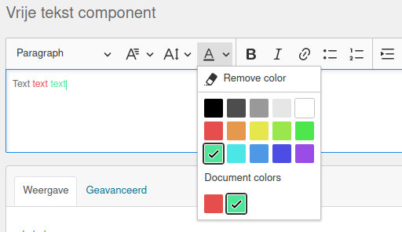

.. _configuration_general_styling:

Layout and styling
==================

Via **Admin** > **Configuratie** > **Algemene configuratie**, section
**Organization configuration**, you can configure the look and feel of the forms and html-email.

**Logo**

You can upload a logo to be used in the header here. If no logo is uploaded, a plain
link will be shown. Logo's can be the usual image formats, or an SVG image.

**Main website link**

The main website link is used so the end-user can return to you main website, e.g.
``https://www.gemeente.nl``. Clicking the logo (or link) in the header will return the
end-user to this URL.

**Theme CSS class name**

You can specify a CSS class name to apply to the root ``html`` element here. Typically
you need this if you use an NL Design System design token package which emits the design
tokens under this class name scope.

Example value: ``<gemeente>-theme``.

The `NL DS theme switcher`_ source code contains a list of built in themes and their
class names.

**Theme stylesheet URL**

If your organization publishes their design tokens as a package, you can use the
resulting CSS file here by specifying the URL to the hosted stylesheet.

The `NL DS theme switcher`_ source code contains a list of built in themes with
available hosted stylesheets under the ``href`` key.

.. note::

   If you are specifying an externally hosted stylesheet, then it will be
   blocked by default by the Content-Security-Policy (CSP).

   Navigate to **Admin** > **Configuratie** > **Csp settings** and add an entry to put
   this stylesheet on the allowlist. For the *directive* field, select ``style-src``,
   while the *Waarde* field should contain the (base) URL of the stylesheet, e.g.
   ``https://unpkg.com/@gemeente-denhaag/``.

.. note::

    This configuration option is not supported in the HTML e-mail styling, please use
    the "design token values" for that instead.

    HTML e-mails have notoriously bad CSS support - this limitation is unfortunately
    outside of our hands.

**Design token values**

With the design token values, you can control aspects such as back- and foreground
colors in the skeleton. This is considered advanced usage, as the structure from
`style dictionary`_ is used.

The following design tokens are currently available:

.. code-block:: text

    // anchors
    --of-link-color
    --of-link-hover-color

    // page header
    --of-page-header-bg
    --of-page-header-fg
    --of-page-header-mobile-padding
    --of-page-header-tablet-padding
    --of-page-header-laptop-padding
    --of-page-header-desktop-padding
    --of-header-logo-url  // automatically set if you upload a logo
    --of-header-logo-width
    --of-header-logo-height

    // footer
    --of-page-footer-bg
    --of-page-footer-fg

    // main body
    --of-layout-bg

All design tokens are optional and have default values.

The configuration in the admin requires this to be provided as JSON, for example:

.. code-block:: json

    {
        "page-header": {
            "fg": {
                "value": "#000"
            },
            "bg": {
                "value": "#2980b9"
            }
        },
        "page-footer": {
            "fg": {
                "value": "#000"
            },
            "bg": {
                "value": "#2980b9"
            }
        },
        "header-logo": {
            "width": {
                "value": "200px"
            },
            "height": {
                "value": "75px"
            }
        },
        "layout": {
            "bg": {
                "value": "#e6e6e6"
            }
        },
        "link": {
            "color": {
                "value": "#000"
            },
            "hover": {
                "color": {
                    "value": "fuchsia"
                }
            }
        }
    }

.. _NL DS theme switcher: https://github.com/nl-design-system/themes/blob/main/packages/theme-switcher/src/index.js
.. _style dictionary: https://amzn.github.io/style-dictionary/

.. todo::

    * Update e-mail to use design tokens from CSS file -> figure out if we can source a
      resolved JSON instead?
    * Refactor ``openforms.emails.context._get_design_token_values`` to be a template tag
      instead, e.g. ```` which
      takes into account the entire resolution.
    * Optimize design tokens similarly to ``manifest.json`` so that it's kept in memory?
      This avoids network lookups (only update this when the config in admin changes)
      and even avoids file IO to build the resolved dictionary. We could include
      style-dict in the container image for this perhaps, but that requires NodeJS to
      be present... possibly set up a dedicated service for this.

Additional design token values examples
^^^^^^^^^^^^^^^^^^^^^^^^^^^^^^^^^^^^^^^

For 'inverted logos' it is possible to change the background colour of the header. The design token values have to be
set to:

.. code-block:: json

    {
      "page-header": {
        "bg": {
          "value": "#35a7cc"
        }
      }
    }

This gives:

.. image:: _assets/background-colour.png

For wider logos, it is possible to increase the size with the following design token values:

.. code-block:: json

    {
      "header-logo": {
        "width": {
          "value": "400px"
        },
        "height": {
          "value": "75px"
        }
      }
    }

Which gives:

.. image:: _assets/logo-size.png

Color presets for rich text content component
^^^^^^^^^^^^^^^^^^^^^^^^^^^^^^^^^^^^^^^^^^^^^

Via **Admin** > **Miscellaneous** > **Text editor color presets** you can manage the shared color presets palette used by the rich text editor of the content-component.

You can freely add, change or remove presets to create a collection of consistent colors for use in free text. These are then available here:

.. note:: Changing the presets doesn't change text with previously applied colors.
