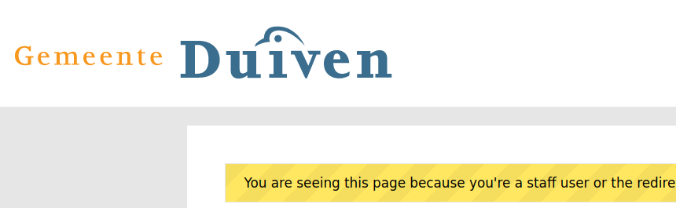

.. _configuration_general_styling:

Layout and styling
==================

Via **Admin** > **Configuratie** > **Algemene configuratie**, section
**Organization configuration**, you can configure the look and feel of the forms and html-email.

**Logo**

You can upload a logo to be used in the header here. If no logo is uploaded, a plain
link will be shown. Logo's can be the usual image formats, or an SVG image.

**Main website link**

The main website link is used so the end-user can return to you main website, e.g.
``https://www.gemeente.nl``. Clicking the logo (or link) in the header will return the
end-user to this URL.

**Design token values**

With the design token values, you can control aspects such as back- and foreground
colors in the skeleton. This is considered advanced usage, as the structure from
`style dictionary`_ is used.

The following design tokens are currently available:

.. code-block:: text

    // anchors
    --of-color-link
    --of-color-link-hover

    // page header
    --of-page-header-background
    --of-page-header-padding-mobile
    --of-page-header-padding-tablet
    --of-page-header-padding-laptop
    --of-page-header-padding-desktop
    --of-logo-header-url  // automatically set if you upload a logo
    --of-logo-header-width
    --of-logo-header-height

    // footer
    --of-footer-background
    --of-footer-color

    // main body
    --of-layout-background

All design tokens are optional and have default values.

The configuration in the admin requires this to be provided as JSON, for example:

.. code-block:: json

    {
        "page-header": {
            "color": {
                "value": "#000"
            },
            "background": {
                "value": "#2980b9"
            }
        },
        "footer": {
            "color": {
                "value": "#000"
            },
            "background": {
                "value": "#2980b9"
            }
        },
        "logo-header": {
            "width": {
                "value": "200px"
            },
            "height": {
                "value": "75px"
            }
        },
        "layout": {
            "background": {
                "value": "#e6e6e6"
            }
        },
        "color": {
            "link": {
                "value": "#000"
            },
            "link-hover": {
                "value": "fuchsia"
            }
        }
    }

.. _style dictionary: https://amzn.github.io/style-dictionary/

**Style of required fields in forms**

When building a form, fields are not marked as required by default. In order to turn a field into a required field,
one has to check the checkbox 'required' in the edit form of the component. Any fields in a form that are marked as
required are then shown in the UI with a red asterisk on the right of the label.

This default behaviour can be changed. Under **Admin** > **Configuratie** > **Algemene configuratie**, there are two
options:

* **Form fields required default**
   If this checkbox is checked, fields will be required by default.
   This means that to make them optional, one will have to uncheck the 'required' checkbox in the edit form of the
   component.
* **Form display required with asterisk**
   If this checkbox is unchecked, required fields will no longer have an asterisk
   next to the label. Optional fields will instead have '(optional)' next to the label.

Additional design token values examples
^^^^^^^^^^^^^^^^^^^^^^^^^^^^^^^^^^^^^^^

For 'inverted logos' it is possible to change the background colour of the header. The design token values have to be
set to:

.. code-block:: json

    {
      "page-header": {
        "background": {
          "value": "#35a7cc"
        }
      }
    }

This gives:

.. image:: _assets/background-colour.png

For wider logos, it is possible to increase the size with the following design token values:

.. code-block:: json

    {
      "logo-header": {
        "width": {
          "value": "400px"
        },
        "height": {
          "value": "75px"
        }
      }
    }

Which gives:

