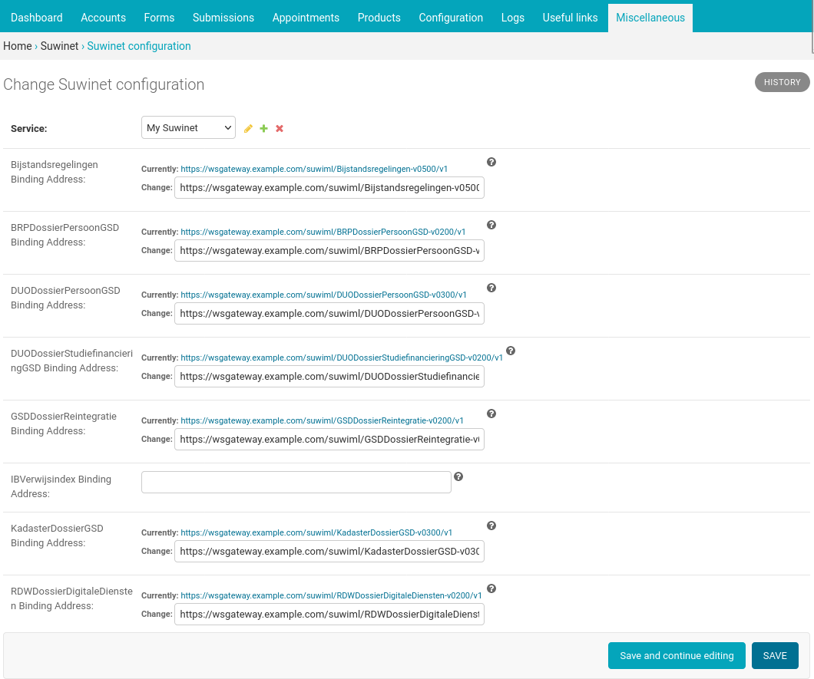

.. _configuration_prefill_suwinet:

=======
Suwinet
=======

`Suwinet`_ is a collection of SOAP services connecting municipalities and several social
services. You can configure Open Forms to use these services to prefill data of the
authenticated person filling out the form.

.. note::

   This service contains sensitive data and requires a connection to an
   external system, offered by `BKWI`_.

.. _`Suwinet`: https://bkwi.nl/producten/suwinet-inlezen
.. _`BKWI`: https://www.bkwi.nl

Configuration
=============

The Open Forms Suwinet plugin supports Suwinet Access via a Gateway server. To configure
it, you need:

 A client certificate key pair
   the plugin uses this for the mTLS with the Gateway *and* to sign all the requests
   to the services that require WSSE. Make sure the services you plan to use have this
   public certificate —and possibly the chain— for validation.
 A server certificate
   for the mTLS connection to the Gateway
 URLs of the binding addresses
   for the services you plan to use in your forms

1. In Open Forms, navigate to: **Miscellaneous** > **Suwinet configuration**
2. Add a SOAP service
3. In the new SOAP service popup fill in these details:

   - **Label**: *Fill in a human readable label*, for example: ``My Suwinet``
   - **URL**: *Leave **empty***
   - **SOAP version**: SOAP 1.2
   - **Client certificate**: Add your certificate+key-pair and give it a recognisable label.
   - **Server certificate**: Add the gateway certificate and give it a recognisable label.

4. For each service you plan to use in forms, fill in the URL on your Gateway where Open
   Forms can reach it.

Technical
=========

Open Forms uses these versions of the WSDL descriptions of the SOAP services:

====================================================  =========
Service                                               Version
====================================================  =========
BRPDossierPersoonGSD                                  v0200-b02
Bijstandsregelingen                                   v0500-b04
DUODossierPersoonGSD                                  v0300-b01
DUODossierStudiefinancieringGSD                       v0200-b01
GSDDossierReintegratie                                v0200-b04
IBVerwijsindex                                        v0300-b01
KadasterDossierGSD                                    v0300-b02
RDWDossierDigitaleDiensten                            v0200-b01
RDWDossierGSD                                         v0200-b02
SVBDossierPersoonGSD                                  v0200-b01
UWVDossierAanvraagUitkeringStatusGSD                  v0200-b01
UWVDossierInkomstenGSDDigitaleDiensten                v0200-b01
UWVDossierInkomstenGSD                                v0200-b02
UWVDossierQuotumArbeidsbeperktenGSD                   v0300-b01
UWVDossierWerknemersverzekeringenGSDDigitaleDiensten  v0200-b01
UWVDossierWerknemersverzekeringenGSD                  v0200-b01F
UWVWbDossierPersoonGSD                                v0200-b01
====================================================  =========
