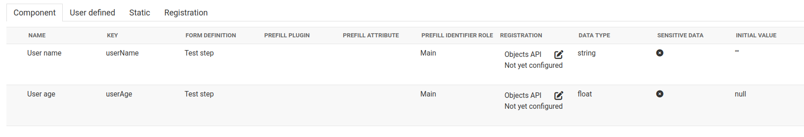
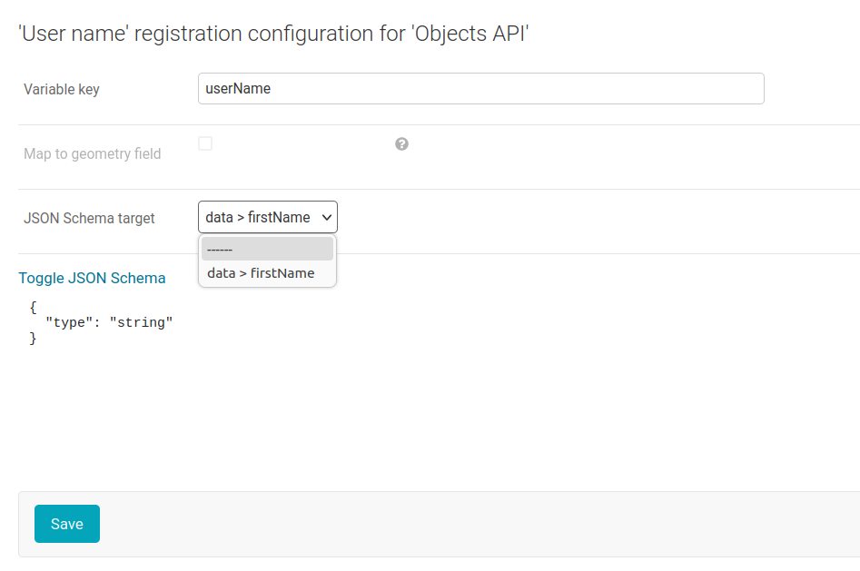

.. _configuration_registration_objects:

===========
Objects API
===========

The `Objects API`_ allows us to easily store and expose various objects
according to the related objecttype resource in the Objecttypes API. Open Forms
supports creating objects in the Objects API, such as the `ProductAanvraag objecttype`_.

Open Forms can be configured to create an object (of type ``ProductAanvraag``) to
register form submissions.

Since Open Forms ``2.6.0``, a new way of configuring the form registration is available.
Hereafter, we will refer to this new configuration as the *Variables mapping (v2)* configuration.
The old configuration will be refered as the *Legacy (v1)* configuration.

What does the Open Forms administator need?
===========================================

* API resource URL of object type(s) to use for registration. If using the *Variables mapping (v2)*
  configuration, access to the Objecttypes API where the object type(s) leave is required.
* Access the Objects API, with write permissions for the relevant Objecttypes. Open
  Forms creates and updates records.
* API resource URLs of document types (informatieobjecttype) in the Catalogi API -
  attachments are created using these document types:

    - PDF summary of submitted form data
    - CSV export of submitted form data (optional)
    - Attachments from uploads done by the end-user through ``file`` components.

* Write access to the Documenten API, some attachments/files are created there and then
  related to the record in the Objects API.

.. warning::

   When using the *Legacy (v1)* configuration, a PATCH request is made to the
   Objects API to update the payment status (for forms with a payment requirement).
   This requires a version of the Objects API newer than 2.1.1. When using the
   *Variables mapping (v2)* configuration, a PUT request is made instead.

Configuration
=============

To configure the Objects API follow these steps:

#. In Open Forms, navigate to: **Configuration** > **Services**
#. Create a service for the Objects API (ORC) where the form data will be registered.

   a. Click **Service toevoegen**.
   b. Fill out the form:

      * **Label**: *Fill in a human readable label*, for example: ``My Objects API``
      * **Type**: Select the type: ``ORC``
      * **API root url**: The root of this API, *for example* ``https://example.com/objecten/api/v2/``

      * **Authorization type**: Select the option: ``API Key``
      * **Header key**: Fill in ``Authorization``
      * **Header value**: Fill in ``Token <tokenValue>`` where ``<tokenValue>`` is replaced by the token provided by the backend service
      * **OAS**: URL that points to the OAS, same URL as used for **API root url** with ``/schema/openapi.yaml`` added to it
        *for example:* ``https://example.com/objecten/api/v1/schema/openapi.yaml``

      * **NLX**: Support for NLX can be selected here if enabled in the installation
      * **User ID**: Audit trail user ID, usually same as the Client ID
      * **User representation**: *For example:* ``Open Forms``

   c. Click **Opslaan** and repeat to create configuration for the other component.

#. If using the *Variables mapping (v2)* configuration, create a service for the Objecttypes API (ORC).

   a. Click **Service toevoegen**.
   b. Fill out the form:

      * **Label**: *Fill in a human readable label*, for example: ``My Objecttypes API``
      * **Type**: Select the type: ``ORC``
      * **API root url**: The root of this API, *for example* ``https://example.com/objecttypen/api/v2/``

      * **Authorization type**: Select the option: ``API Key``
      * **Header key**: Fill in ``Authorization``
      * **Header value**: Fill in ``Token <tokenValue>`` where ``<tokenValue>`` is replaced by the token provided by the backend service
      * **OAS**: URL that points to the OAS, same URL as used for **API root url** with ``/schema/openapi.yaml`` added to it
        *for example:* ``https://example.com/objecttypen/api/v1/schema/openapi.yaml``

      * **NLX**: Support for NLX can be selected here if enabled in the installation
      * **User ID**: Audit trail user ID, usually same as the Client ID
      * **User representation**: *For example:* ``Open Forms``

   c. Click **Opslaan** and repeat to create configuration for the other component.

#. Create a service for the Documentregistratiecomponent (DRC) where the PDF summary and form attachment documents will be stored.

   a. Click **Service toevoegen**.
   b. Fill out the form:

      * **Label**: *For example:* ``Documenten``
      * **Type**: Select the type: ``DRC``
      * **API root url**: The root of this API, *for example* ``https://example.com/documenten/api/v1/``

      * **Client ID**: Fill the value provided by the backend service *For example:* ``open-forms``
      * **Secret**: Fill the value provided by the backend service
      * **Authorization type**: Select the option: ``ZGW client_id + secret``
      * **OAS**: URL that points to the OAS, same URL as used for **API root url** with ``/schema/openapi.yaml`` added to it
        *for example:* ``https://example.com/documenten/api/v1/schema/openapi.yaml``

      * **NLX**: Support for NLX can be selected here if enabled in the installation
      * **User ID**: Audit trail user ID, usually same as the Client ID
      * **User representation**: *For example:* ``Open Forms``

#. Create a service for the Zaaktypecatalogus (ZTC). This is needed to retrieve Informatieobjecttypen.

   a. Click **Service toevoegen**.
   b. Fill out the form:

      * **Label**: *For example:* ``Catalogi``
      * **Type**: Select the type: ``ZTC``
      * **API root url**: The root of this API, *for example* ``https://example.com/catalogi/api/v1/``

      * **Client ID**: Fill the value provided by the backend service *For example:* ``open-forms``
      * **Secret**: Fill the value provided by the backend service
      * **Authorization type**: Select the option: ``ZGW client_id + secret``
      * **OAS**: URL that points to the OAS, same URL as used for **API root url** with ``/schema/openapi.yaml`` added to it
        *for example:* ``https://example.com/catalogi/api/v1/schema/openapi.yaml``

      * **NLX**: Support for NLX can be selected here if enabled in the installation
      * **User ID**: Audit trail user ID, usually same as the Client ID
      * **User representation**: *For example:* ``Open Forms``

#. Navigate to **Configuration** > **Overview**. In the **Registration plugin** group, click on **Configuration** for the **Objects API registratie** line.
#. Enter the following details:

   * **Objects API**: Select the Objects API (ORC) service created above
   * **Objecttypes API**: Only if using the *Variables mapping (v2)*, select the Objecttypes API (ORC) service created above
   * **Documenten API**: Select the Documentregistratiecomponent (DRC) service created above
   * **Catalogi API**: Select the Zaaktypecatalogus (ZTC) service created above
   * **Productaanvraag type**: Fill in the type of ProductAanvraag *For example:* ``terugbelnotitie``
   * **Submission report informatieobjecttype**: Fill in the default URL of the INFORMATIEOBJECTTYPE for the submission report in the Catalogi API *For example* ``https://example.com/api/v1/informatieobjecttypen/1/``
   * **Upload submission CSV**: Indicate whether or not the submission CSV should be uploaded to the Documenten API by default (can be overridden per form)
   * **Submission report CSV informatieobjecttype**: Fill in the default URL of the INFORMATIEOBJECTTYPE for the submission report CSV in the Catalogi API *For example* ``https://example.com/api/v1/informatieobjecttypen/2/``
   * **Attachment informatieobjecttype**: Fill in the default URL of the INFORMATIEOBJECTTYPE for the submission attachments in the Catalogi API *For example* ``https://example.com/api/v1/informatieobjecttypen/3/``
   * **Organisatie RSIN**: Fill the RSIN to be referred to in the created objects. *For example:* ``123456789``

   If using the *Legacy (v1)* configuration, the default JSON templates can be configured as well:

   * **JSON content template**: This is a template for the JSON that will be sent to the Object API nested in the
     ``record.data`` field.
   * **Payment status update JSON template**: This is a template for the JSON that will be sent with a PATCH request to
     the Object API to update the payment status of a submission. This JSON will be nested in the ``record.data.payment`` field.

#. Click **Opslaan**

The Objects API configuration is now complete and can be selected as registration backend in the form builder.
When doing so, the corresponding objecttype and objecttype version will have to be configured.

.. versionchanged:: 2.6.0

  The objecttype URL and version should be configured at the form level, and can't be configured globally.

Using the *Legacy (v1)* configuration
=====================================

When using a the legacy configuration, the JSON template (either the global default configured above or
the one specified at the form level) will be rendered a fixed input (e.g. the submission variables, the payment status).

Using this legacy format is discouraged due to the limited customization it offers.

Below is an example of the contents in the ``record.data`` attribute in the
Objects API. The top-level has meta-data about the form submission, and the
``data`` element holds the submitted form values, nested within each step (using the step-slug as key):

.. tabs::

   .. group-tab:: Example

      .. code-block:: json

         {
           "data": {
             "uw-gegevens": {
               "naam": "Jan Jansen",
               "omschrijving": "Ik heb een vraag over mijn paspoort",
               "telefoonnummer": "0612345678"
             }
           },
           "type": "terugbelnotitie",
           "bsn": "111222333",
           "pdf_url": "https://example.com/documenten/api/v1/enkelvoudiginformatieobjecten/230bab4a-4b51-40c6-91b2-f2022008a7f8",
           "attachments": [],
           "submission_id": "a43e84ac-e08b-4d5f-8d5c-5874c6dddf56"
         }

   .. group-tab:: JSON-schema for Objecttype

      .. code-block:: json

         {
           "title": "ProductAanvraag",
           "default": {},
           "required": [
             "submission_id",
             "type",
             "data"
           ],
           "properties": {
             "data": {
               "$id": "#/properties/data",
               "type": "object",
               "title": "Object met de ingezonden formulierdata",
               "default": {},
               "examples": [
                 {
                   "field1": "value1"
                 }
               ]
             },
             "type": {
               "$id": "#/properties/type",
               "type": "string",
               "title": "Type productaanvraag",
               "default": "",
               "examples": [
                 "terugbelnotitie"
               ]
             },
             "bsn": {
               "$id": "#/properties/bsn",
               "type": "string",
               "title": "Burgerservicenummer",
               "default": "",
               "examples": [
                 "111222333"
               ]
             },
             "kvk": {
               "$id": "#/properties/kvk",
               "type": "string",
               "title": "KVK-nummer van het bedrijf in het Handelsregister",
               "default": "",
               "examples": [
                 "12345678"
               ]
             },
             "pdf_url": {
               "$id": "#/properties/pdf_url",
               "type": "string",
               "title": "URL van een document (in een Documenten API) dat de bevestigings PDF van Open Forms bevat",
               "format": "uri",
               "default": "",
               "examples": [
                 "https://example.com/documenten/api/v1/enkelvoudiginformatieobjecten/230bab4a-4b51-40c6-91b2-f2022008a7f8"
               ]
             },
             "csv_url": {
               "$id": "#/properties/csv_url",
               "type": "string",
               "title": "URL van een document (in een Documenten API) dat de CSV met ingezonden formulierdata bevat",
               "format": "uri",
               "default": "",
               "examples": [
                 "https://example.com/documenten/api/v1/enkelvoudiginformatieobjecten/aeaba696-4968-46a6-8b1e-016f503ed88d"
               ]
             },
             "attachments": {
               "$id": "#/properties/attachments",
               "type": "array",
               "items": {
                 "type": "string",
                 "format": "uri"
               },
               "title": "Lijst met URLs van de bijlagen van het ingezonden formulier in een Documenten API",
               "default": [],
               "examples": [
                 [
                   "https://example.com/documenten/api/v1/enkelvoudiginformatieobjecten/94ff43d6-0ee5-4b5c-8ed7-b86eaa908718"
                 ]
               ]
             },
             "submission_id": {
               "$id": "#/properties/submission_id",
               "type": "string",
               "title": "ID van de submission in Open Forms",
               "default": "",
               "examples": [
                 "a43e84ac-e08b-4d5f-8d5c-5874c6dddf56"
               ]
             },
             "additionalProperties": true
           }
         }

Using the *Variables mapping (v2)* configuration
================================================

When using the variables mapping configuration, each variable can be mapped to a specific location in the object type
JSON Schema. This configuration takes place in the **Variables** tab. To demonstrate how variables can be configured,
we will assume the following JSON Schema defines the object type being used:

.. code-block:: json

  {
    "$schema": "http://json-schema.org/draft-07/schema#",
    "type": "object",
    "properties": {
      "payment_completed": {"type": "boolean"},
      "data": {
        "type": "object",
        "properties": {
          "firstName": {"type": "string"},
          "age": {"type": "integer"}
        }
      }
    }
  }

.. note::

  The JSON Schema is parsed internally by Open Forms. For best results, your schema should
  follow these guidelines:

  - If possible, define a ``"$schema"`` URI pointing to the specification you are using. If not specified,
    Open Forms will assume the latest specification (*2020-12*) applies, which might not be compatible.
  - Do not omit the ``"type"`` key (in our case, ``"object"``). Only defining ``"properties"`` is not enough,
    as having ``"type"`` unspecified means any type of data can be set.
  - Using references is supported, but shouldn't point to an external entity. Be sure to use the ``$ref``
    keyword to point to a specific reference.

We will also assume the form has one step with two components defined:

- A text field with a key of ``userName``.
- A number field with a key of ``userAge``.

The **Variables** tab should look like the following:

Mapping variables
-----------------

Each variable needs to be mapped to a target individually. To do so, click the edit icon in the
registration column. A modal should open with the following content:

For each variable, only the compatible JSON Schema targets (in our case, *data > firstName*) will be presented.
Once selected, click **Save** and do the same for the ``userAge`` variable.

To be able to map register "meta" information about the submission (such as the payment completion),
the Objects API registration provides *registration variables*. These are only available during registration,
and behaves the same way other variables do. To configure a mapping for the ``"payment_completed"`` JSON Schema target,
go to the **Registration** tab (next to **Static**) and configure the *Payment completed* variable by mapping it to
``payment_completed`` (this should be the only option available).

Registration result
-------------------

With the mapping configuration provided above, the payload sent to the Objects API will look like the following:

.. code-block:: json

  {
    "type": "https://example.com/objecttypen/api/v2/objecttypes/7e6a98c3-bf02-41a6-8835-5367f6099780",
    "record": {
      "typeVersion": 1,
      "data": {
        "payment_completed": true,
        "data": {
          "firstName": "Filled first name",
          "age": 20
        }
      },
      "startAt": "2024-01-01"
    }
  }

Mapping a variable to the ``"geometry"`` component
--------------------------------------------------

As shown in the image above, it is possible to map a specific variable (usually a Map component)
to the ``"record.geometry"`` target. When this option is selected, the variable will appear as the
geometry component in the Objects API.

Technical
=========

Open Forms requires Objects API v2 or newer.

================  ==========================================
Objects API       Test status
================  ==========================================
2.0.x             Manually verified
2.1.x             Manually verified, integration tests in CI
================  ==========================================

.. _`Objects API`: https://objects-and-objecttypes-api.readthedocs.io/
.. _`ProductAanvraag objecttype`: https://github.com/open-objecten/objecttypes/tree/main/community-concepts/productaanvraag/
