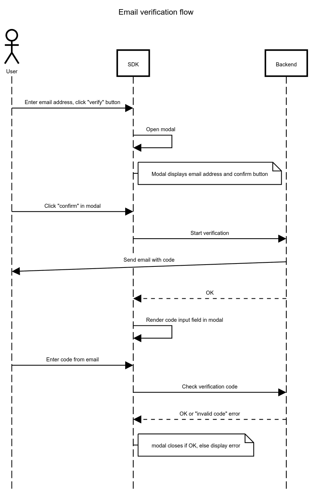

.. _developers_backend_core_email_verification:

========================
Core: email verification
========================

Form designers can optionally require email verification for email components. Email
verification is disabled by default. When it's enabled, the following process takes
place.

Sequence diagram
================

The `sequence diagram`_ describes the flow. The user is the person filling out the
submission, the SDK is the UI exposed to the user and the backend represents the API
called by the SDK.

.. _sequence diagram: https://sequencediagram.org/index.html#initialData=C4S2BsFMAIFEFsCGJzQG6QE4gGYgMaKgD2AdtDuMQO4BQti+wxm0AqgM5a0AOimofCD6lg0AMoARANK9+g4YlHQAQowDWkUgBN6nLAFoAfFOkAuOKKzRISFNETbtmSBw4AaaPnAF10AEQY2DgAnv7QAEYArsDMpLSmxqYWAPI8WtDwxNqI4LSkxMAw2ADmABZixDgSMhYAstm50NogHDzgiCEcNnaojs6u3UraXmR4mPCRMXG0+phJtdAAwj74fv74YyAT4SDkWTl5iUZqa1raFuLA8uhYuAREIGS0p5o6xgAUAIwAlHOX5x6yFQ1DAZVG2kgCRkAB4DAZXudUrJjsloAAlc7WTaQ6B7HgxCggSDgEZ7TKNPJzBbmSxFVg4mA4TDESa2YHQ6TGRE6CxLMqQNa3YIPEjkRmcuEIjRI6ApaTQFgBPZoXIgEaM8JYFmYfKFYogcqVapog5NbzELjdXBy6SeElcZqtdqdGyYHVAA

**Description**

1. The verification process starts with an explicit confirm action by the user (clicking
   the confirm button in the modal rendered by the SDK).
2. This triggers an API call that creates the verification request in the backend. It
   captures (and validates) the submission, the email address and the formio component
   key of the email component. Multiple email components can be present in the form, each
   requiring verification. A code is generated and stored in the database, and an email
   is sent containing the generated code. The code may not be exposed via the API.
3. Upon successful start, the modal confirms that an email is underway (repeating the
   email address) and displays an input field for the verification code.
4. The user can enter the code and click a "confirm" button to verify the code. The API
   endpoint receives submission, component key, email address and code. On success, the
   backend updates the state to ``verified: true``.
5. The modal closes and the user can continue with the rest of the form.
6. Once the step is submitted, backend validation checks that the values of email
   components have a matching verified status, if not, validation errors are displayed.

Design decisions made
=====================

**No unique constraints**

No unique constraints to enforce the combination of email, component key and submission
to be unique. The reason for this is that it's possible an email does not arrive, and
in those situations, users must be able to request another verification, which ideally
has a different code.

Additionally, doing de-duplication checks complicates the implementation, and the cost
of allowing duplicates is low.

**Multiple email addresses for the same component are allowed**

Multiple (different) addresses are allowed for two reasons:

* the component may have ``{"multiple": True}``, which associates multiple values with
  a single component/field already. Each address needs to be verified to proceed.
* the user may make a mistake, realize (because of the verification) that they made a
  typo, and correct their input. This naturally leads to multiple values for the same
  component, of which only one is actually relevant.

**Verification codes are not globally unique**

We randomly generate 6-character verification codes (excluding confusing characters),
which has a chance of producing the same code multiple times. A code is used in the
context of a single submission and a single form component/field, they cannot be used
in other submissions belonging to someone else.

**Brute forcing verification codes**

The default rate limits and permission checks should mitigate this. If needed,
additional protections can be added in the future.
