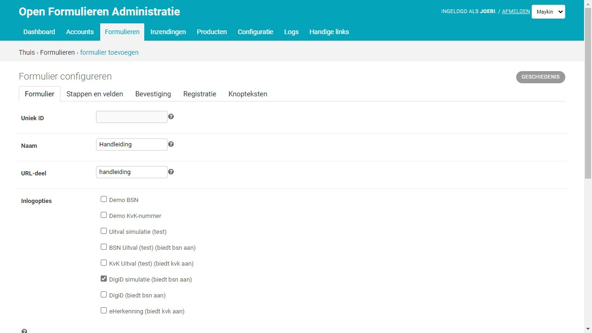
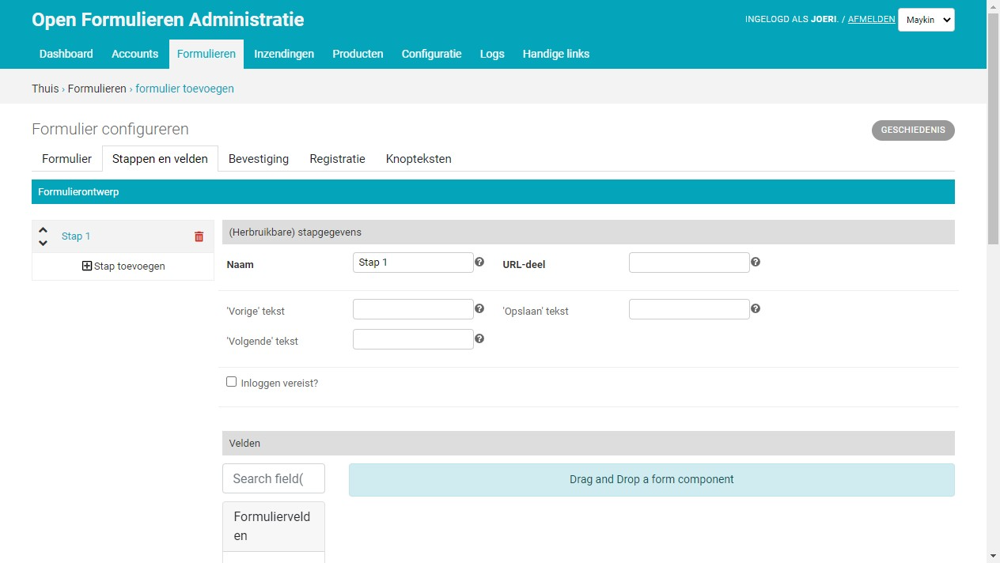

===================
Formulieren beheren
===================

Een formulier bestaat (meestal) uit meerdere stappen. Een stap is in feite een
deelformulier dat we een **formulier definitie** noemen. Een **formulier**
bestaat daarom uit 1 of meerdere **formulier definities**, die de stappen van
het formulier vormen.

Een **formulier definitie** kan hergebruikt worden in andere formulieren.

Formulieren overzicht
=====================

1. Navigeer naar **Formulieren** > **Formulieren**.

U kunt vanaf deze pagina:

* De lijst van formulieren sorteren en filteren
* De details opvragen van een specifiek formulier
* Een Formulier :ref:`importeren <manual_export_import>`
* Een Nieuw formulier aanmaken
* Bulk acties uitvoeren op formulieren

  * Verwijderen
  * Kopiëren
  * Onderhoudsmodus aan zetten
  * Onderhoudsmodus uit zetten

Nieuw formulier aanmaken
========================

1. Navigeer naar **Formulieren** > **Formulieren**.
2. Klik op **Formulier toevoegen**

Er verschijnen enkele tabbladen waarmee het formulier geconfigureerd kan
worden. Onder de tabbladen zit de knop **Opslaan**. Pas als u op deze knop heeft
gedrukt wordt het formulier daadwerkelijk opgeslagen.

Hieronder gaan we in op elk tabblad.

Formulier
---------

.. note::

    Standaard staat **Actief** aangevinkt. Dit betekent dat zodra u een
    formulier opslaat, deze bereikbaar is voor iedereen.

In dit tabblad worden de algemene formulier gegevens weergegeven.

* **Uniek ID**: Een ID dat het formulier technisch identificeert maar is verder
  niet zichtbaar voor eindgebruikers.
* **Naam**: Wordt getoond aan de eindgebruiker en staat altijd bovenaan het
  formulier en het stappen overzicht.
* **URL-deel**: Dit is een deel van de URL die zichtbaar is in de navigatiebalk
  van de browser. Een *URL-deel* ``demo-formulier`` kan in de browser te zien
  zijn als ``https://klant.open-formulieren.nl/demo-formulier``.
* **Inlogopties**: Als voor een formulier ingelogd moet worden kan een van de
  beschikbare inlog opties worden aangevinkt.

  * **DigiD**: Inloggen via DigiD. Hiermee wordt het BSN van de gebruiker
    verkregen en opgeslagen op de inzending. Het BSN kan ook gebruikt worden
    om persoonsgegevens voor in te vullen.
  * **eHerkenning**: Inloggen met eHerkenning via uw broker. Hiermee wordt het
    KvK-nummer vekregen en opgeslagen op de inzending. Het BSN kan ook gebruikt
    worden om bedrijfsgegevens voor in te vullen.

  Onderstaande inlogopties zijn **alleen voor testdoeleinden** geschikt:

  * **Demo BSN**: Stelt beheerders in staat inloggen te simuleren
    waarbij een op te geven BSN opgeslagen wordt op de inzending.
  * **Demo KvK-nummer**: Stelt beheerders in staat inloggen te simuleren
    waarbij een op te geven KvK-nummer opgeslagen wordt op de inzending.
  * **Uitval simulatie (test)**: Stelt beheerders in staat te simuleren dat een
    willekeurig inlog proces faalt. Het formulier geeft direct een foutmelding.
  * **BSN Uitval (test)**: Stelt beheerders in staat te simuleren dat een
    inlog proces dat een BSN teruggeeft faalt. Het formulier geeft direct een
    foutmelding.
  * **KvK Uitval (test)**: Stelt beheerders in staat te simuleren dat een
    inlog proces dat een KvK-nummer teruggeeft faalt. Het formulier geeft
    direct een foutmelding.
  * **DigiD simulatie**: Stelt beheerders in staat inloggen te simuleren
    op een DigiD demo omgeving waarbij de gebruikersnaam wordt opgeslagen als
    BSN op de inzending.

* **Toon voortgang**: Vink aan om de stappen bij een formulier te tonen. Typisch
  kan deze worden uitgevinkt indien er een slechts beperkt aantal stappen is.
* **Actief**: Vink aan om het formulier beschikbaar te maken voor de
  buitenwereld.
* **Onderhoudsmodus**: Vink aan om het formulier in onderhoudsmodus te zetten.
  Als het formulier in onderhoudsmodus staat, kan het formulier niet gestart
  worden en verschijnt er een melding voor de eindgebruiker.
* **Inzenden mogelijk**: Vink aan om eindgebruikers het formulier te laten
  versturen. Sommige formulieren dienen niet verstuurd te worden maar geven
  bijvoorbeeld alleen informatie of verwijzingen naar andere formulieren. In dat
  geval vinkt u deze optie uit.

.. note::

  Indien een of meer **Inlogopties** zijn geselecteerd, dan verschijnt aan het
  begin van het formulier een knop om in te loggen. Echter, als er geen stappen
  in het formulier zitten die **Inloggen vereisen** (zie hieronder) dan kan het
  formulier ook gestart worden *zonder in te loggen*.

Stappen en velden
-----------------

In dit tabblad kunnen de formulier stappen worden geconfigureerd.

* U kunt een **stap toevoegen** door aan de linkerkant op het **+** icoon te
  klikken. U krijgt vervolgens de keuze om een bestaande formulier definitie
  te kiezen (die al in een ander formulier wordt gebruikt), of een nieuwe aan te
  maken.
* U kunt een **stap verwijderen** door aan de linkerkant, naast de stap naam, op
  het **vuilnisbak**-icoon te klikken. U verwijdert hiermee nooit een formulier
  definitie maar u verwijdert deze slechts als stap binnen dit formulier.
* U kunt de **volgorde van stappen wijzigen** met de **omhoog** en **omlaag**
  icoontjes voor de stap naam.
* U kunt de **details** van een stap bekijken door op de stap naam te klikken.

Het tabblad bestaat uit 2 secties: **(Herbruikbare) stapgegevens** en
**Velden**. Beide secties horen bij de huidige (rechts geselecteerde) formulier
stap.

**(Herbruikbare) stapgegevens**

* **Naam**: Wordt als stap in stappen overzicht en bovenaan het formulier.
* **URL-deel**: Dit is een deel van de URL die zichtbaar is in de navigatiebalk
  van de browser. Een *URL-deel* ``stap-1`` kan in de browser te zien
  zijn als ``https://klant.open-formulieren.nl/demo-formulier/stap-1``.
* **Inloggen vereist**: Geeft aan of voor deze stap inloggen is vereist. Zodra
  een formulier één of meerdere stappen bevat waarvoor inloggen is vereist, dan
  moet een *Inlogoptie* aangevinkt zijn onder het tabblad *Formulier*.

**Velden**

In deze sectie kunt u velden (ook wel componenten genoemd) naar de formulier
stap slepen en configureren. Kijk voor alle mogelijkheden naar het overzicht van
:ref:`formulier velden <manual_form_fields>` en naar de
:ref:`voorbeelden <manual_examples>`.

Bevestiging
-----------

In dit tabblad kan de bevestiging, die te zien is na het afronden van het
formulier, worden aangepast.

In het veld **Bevestigingspagina tekst** kan een tekst worden opgemaakt die
wordt getoond na het versturen van het formulier. Indien dit veld leeg wordt
gelaten zal de globale **Bevestigingspagina tekst** gebruikt worden.

U kunt in deze tekst variabelen gebruiken. Uitleg hierover vind u bij
:ref:`manual_templates`

Logica
------

In dit tabblad kunnen regels worden gedefinieerd die, afhankelijk van de gegevens die de gebruikers
invult, het formulier kunnen wijzigen.

Regels
^^^^^^

Om een regel op te bouwen, moet een component worden geselecteerd. De component kan worden vergeleken met de waarde
van een andere component, met een waarde gekozen door de beheerder of met een group van waarden.
Voor componenten van type 'datum', is het ook mogelijk om te vergelijken met de datum waarop de gebruiker
het formulier invult.

Acties
^^^^^^

Nadat een regel is gedefinieerd, kunnen een of meerdere acties worden toegevoegd. De acties kunnen het formulier
wijzigen afhankelijk van de gegevens die de gebruiker invult. Er zijn verschillende acties mogelijk:

* Blokkeer doorgaan naar de volgende stap.

* Wijzig een attribuut van een veld/component. Met dit actie kan:

    * Een niet-verplicht veld wordt veranderd in een verplicht veld (of andersom)

    * Een zichtbaar veld wordt verborgen (of een verborgen veld wordt zichtbaar)

    * Een veld kan worden uitgeschakeld

* Wijzig de waarde van een veld/component. Met deze actie kan de waarde van een veld/component worden veranderd naar de waarde van een andere component of een waarde gekozen door de beheerder.

* Markeer een stap als 'niet van toepassing' (n.v.t).

.. image:: _assets/logica_voorbeeld.png
    :width: 100%
