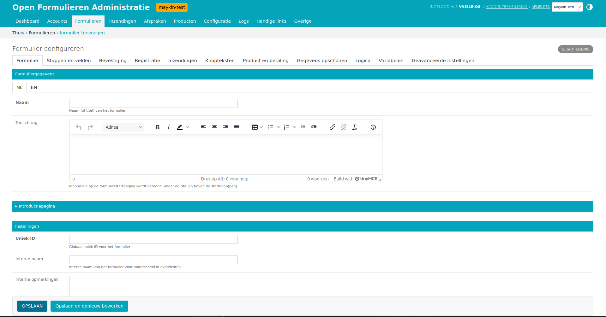
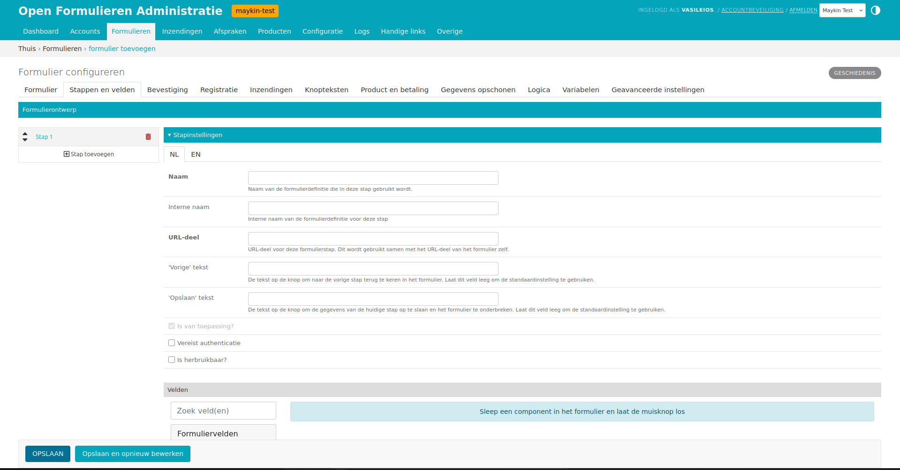

.. _manual_forms_basics:

===================
Formulieren beheren
===================

Een formulier bestaat (meestal) uit meerdere stappen. Een stap is in feite een
deelformulier dat we een **formulier definitie** noemen. Een **formulier**
bestaat daarom uit 1 of meerdere **formulier definities**, die de stappen van
het formulier vormen.

.. note:: Single step forms consist of one step and therefore of one form definition.

Een **formulier definitie** kan hergebruikt worden in andere formulieren.

Formulierenoverzicht
====================

1. Navigeer naar **Formulieren** > **Formulieren**.

U kunt vanaf deze pagina:

* De lijst van formulieren sorteren en filteren
* De details opvragen van een specifiek formulier
* Een Formulier :ref:`importeren <manual_export_import>`
* Een Nieuw formulier aanmaken
* Bulk acties uitvoeren op formulieren

  * Verwijderen
  * Kopiëren
  * Onderhoudsmodus aan zetten
  * Onderhoudsmodus uit zetten
  * Export forms

Nieuw formulier aanmaken
========================

1. Navigeer naar **Formulieren** > **Formulieren**.
2. Klik op **Formulier toevoegen**

Er verschijnen enkele tabbladen waarmee het formulier geconfigureerd kan
worden. Onder de tabbladen zit de knop **Opslaan**. Pas als u op deze knop heeft
gedrukt wordt het formulier daadwerkelijk opgeslagen.

.. note:: Sommige formulieropties kunnen ervoor zorgen dat een tabblad wel of niet
   beschikbaar is. Uw scherm kan er dus wat anders uit zien dan in de screenshots. An
   example is the different type of forms (*regular*, *appointment* and *single step*).

Hieronder gaan we in op elk tabblad.

Formulier
---------

.. note::

    Standaard staat **Actief** aangevinkt. Dit betekent dat zodra u een
    formulier opslaat, deze bereikbaar is voor iedereen.

In dit tabblad worden de algemene formulier gegevens weergegeven. Below you can see some
of the available sections regarding the form configuration (always based on the type of
the form).

* **Form details**: The general form details like the name and the explanation of the form.
* **Introduction page**: If configured, an introduction page can be shown before the real
  form is started.
* **Form configuration**: Some basic information/configuration concerning the identity
  of the form, like the type, the unique id, category etc.
* **Features**: Optional/additional features like enabling form translation.
* **Inlogopties**: Als voor een formulier ingelogd moet worden kan een van de
  beschikbare inlog opties worden aangevinkt.

  Zie ook: :ref:`configuration_authentication_index`

* **Presentation/appearance**: Settings regarding the appearance of a form, like a specific
  theme that should be used.
* **Availability**: The form details that specify when/if a form is active.
* **Submissions settings**: Form configuration regarding the submission.

.. note::

  Als de formuliernaam lange woorden bevat, kunt u optionele koppeltekens (`soft hyphens`_) invoeren om aan te geven waar het woord mag afgebroken worden naar de volgende regel. Op Windows vindt u deze "soft hyphens" in
  het 'Speciale tekens'-programma  en kunt u ze kopiëren/plakken naar Open Forms-velden.

.. _soft hyphens: https://en.wikipedia.org/wiki/Soft_hyphen

.. note::

  Indien een of meer **Inlogopties** zijn geselecteerd, dan verschijnt aan het
  begin van het formulier een knop om in te loggen. Echter, als er geen stappen
  in het formulier zitten die **Inloggen vereisen** (zie hieronder) dan kan het
  formulier ook gestart worden *zonder in te loggen*.

Stappen en velden
-----------------

.. note:: Available only in the *regular* and the *single step* types of form.

In dit tabblad kunnen de formulier stappen worden geconfigureerd.

* U kunt een **stap toevoegen** door aan de linkerkant op het **+** icoon te
  klikken. U krijgt vervolgens de keuze om een bestaande formulier definitie
  te kiezen (die al in een ander formulier wordt gebruikt), of een nieuwe aan te
  maken.
* U kunt een **stap verwijderen** door aan de linkerkant, naast de stap naam, op
  het **vuilnisbak**-icoon te klikken. U verwijdert hiermee nooit een formulier
  definitie maar u verwijdert deze slechts als stap binnen dit formulier.
* U kunt de **volgorde van stappen wijzigen** met de **omhoog** en **omlaag**
  icoontjes voor de stap naam.
* U kunt de **details** van een stap bekijken door op de stap naam te klikken.

.. note:: The *single step* form slightly differs from the above since we only have one
          step.

Het tabblad bestaat uit 2 secties: **(Herbruikbare) stapgegevens** en
**Velden**. Beide secties horen bij de huidige (rechts geselecteerde) formulier
stap.

**(Herbruikbare/major) stapgegevens**

* **Naam**: Wordt als stap in stappen overzicht en bovenaan het formulier.
* **URL-deel**: Dit is een deel van de URL die zichtbaar is in de navigatiebalk
  van de browser. Een *URL-deel* ``stap-1`` kan in de browser te zien
  zijn als ``https://klant.open-formulieren.nl/demo-formulier/stap-1``.
* **Inloggen vereist**: Geeft aan of voor deze stap inloggen is vereist. Zodra
  een formulier één of meerdere stappen bevat waarvoor inloggen is vereist, dan
  moet een *Inlogoptie* aangevinkt zijn onder het tabblad *Formulier*.

**Velden**

In deze sectie kunt u velden (ook wel componenten genoemd) naar de formulier
stap slepen en configureren. Kijk voor alle mogelijkheden naar het overzicht van
:ref:`formuliervelden <manual_form_fields>` en naar de
:ref:`voorbeelden <manual_examples>`.

Bevestiging
-----------

.. note:: Available in all types of form.

In dit tabblad kan de bevestiging, die te zien is na het afronden van het
formulier, worden aangepast alsmede de e-mailbevestiging die gestuurd word naar
de indiener van het formulier.

U kunt in zowel de bevestigingspagina als de e-mailbevestiging gebruik maken
van variabelen. Uitleg hierover vind u bij :ref:`manual_templates`

Sjabloon bevestigingspagina
~~~~~~~~~~~~~~~~~~~~~~~~~~~

In het veld **Inhoud** kan een tekst worden opgemaakt die wordt getoond na
het indienen van het formulier. Indien dit veld leeg wordt gelaten zal de
globale **Bevestigingspagina tekst** gebruikt worden.

Bevestigingsmailsjabloon
~~~~~~~~~~~~~~~~~~~~~~~~

In het veld **Inhoud** kan een tekst worden opgemaakt die gebruikt wordt in de
e-mailbevestiging. Het **Onderwerp** van de email kan ook worden opgegeven.

U moet in de optie **E-mailsjabloon** expliciet opgeven welk e-mailsjabloon
gebruikt wordt voor de e-mailbevestiging. U kunt er ook voor kiezen om geen
e-mailbevestiging te versturen.

Registratie
-----------

.. note:: Available only in the *regular* and the *single step* types of form.

In dit tabblad kunt u aangeven op welke manier uw inzendingen moeten worden
geregistreerd. Alle inzendingen komen altijd binnen bij Open Formulieren zelf
maar kunnen daarnaast doorgezet worden naar een extern systeem.

Zie ook: :ref:`configuration_registration_index`

Submissions
-----------

.. note:: Available in all types of form.

Optional submission limit per form. If set, this can be the limit for the maximum allowed
submissions for a specific form.

Knopteksten
-----------

.. note:: Available only in *regular* and *appointment* types of form.

U kunt de knoppen die standaard in het formulier getoond worden een ander label
geven. De waarden die hier staan overschrijven de labels die globaal zijn
geconfigureerd.

Product en betaling
-------------------

.. note:: Available only in *regular* type of form.

Hier kunt u een **Product** kiezen dat gekoppeld is aan het formulier. Het
product bevat een prijs die gebruikt kan worden als betaald moet worden voor
het product. Betaling kan ingesteld worden door de juiste **Betaalprovider** te
selecteren.

Er zijn twee manieren om de prijs van een inzending te bepalen:

**Gebruik de prijs van het gekoppeld product**

Dit is de meest eenvoudige variant. Er geldt een vaste prijs, die ingesteld wordt op
het product.

**Gebruik een variabele**

Dit is de meest flexibele variant - met behulp van normale **Logica** kan je de waarde
van een variabele zetten om de prijs te berekenen. In het formulier wijs je naar deze
variabele en de waarde van de variabele wordt als prijs gebruikt. Je kan enkel
variabelen selecteren die een numeriek gegevenstype hebben (integer, float).

Let op - er moet altijd een prijs ingesteld staan op het product om de betalingsmodule
te activeren.

.. warning:: Deze methode is foutgevoelig - indien de waarde van de variabele niet
   geschikt is om als prijs te gebruiken of er komt geen geldig getal uit, dan zal
   de eindgebruiker fouten in het formulier ervaren. Zorg ervoor dat de formulieren
   goed getest zijn!

.. versionadded:: 2.8.1 Uitzonderlijk is deze functionaliteit in een patch-release
   toegevoegd. Versie 2.8.0 en ouder hebben deze functionaliteit niet.

**Gebruik prijslogica**

.. versionremoved:: 3.0

   De prijslogica is vervangen door gewone logica + gebruik van een variabele.

Zie ook: :ref:`configuration_payment_index`

Er zijn twee mogelijke flows om inzendingen te registreren voor formulieren waar een betaling nodig is.

1. Zodra de inzending voltooid is, wordt de inzending naar de registratiebackend gestuurd. Als het wordt betaald, wordt
   de status van de betaling in de registratiebackend aangepast. In het geval van de e-mailregistratiebackend, gebeurt
   dit door een extra (update-)e-mail te sturen, terwijl voor StUF-ZDS en ZGW registratiebackends, de betaalstatus van de zaak
   wordt aangepast.
2. De inzending wordt naar de registratiebackend gestuurd pas ná dat de betaling voltooid is.

.. warning:: Afhankelijk van de betalingsprovider, kan het zijn dat de status van de betaling
    op een later moment aangepast kan worden vanuit de betalingsprovider. Dit kan bijvoorbeeld
    voorkomen wanneer een betaling mislukt, maar bij een volgende poging wel slaagt. De
    status van de betaling kan in deze situatie in eerste instantie op "Geannuleerd of mislukt" staan
    maar na een succesvolle poging op "Voltooid door gebruiker".

De flow kan ingesteld worden in de **Algemene Configuratie**.

Zie ook: :ref:`configuration_general_payment_flow`

Gegevens opschonen
------------------

.. note:: Available in all types of forms.

In dit tabblad kunt u de standaardwaarden voor het opschonen van inzendingen
overschrijven.

Logica
------

.. note:: Available only in *regular* and *single step* types of form. Each type of form has
          its own available actions though.

In dit tabblad kunnen regels worden gedefinieerd die, afhankelijk van de
gegevens die de gebruiker invult, zowel de inhoud als het gedrag van het
formulier kunnen wijzigen.

Logica geeft u krachtige mogelijkheden om het formulier dynamischer te maken.
Voorbeelden en uitleg over hierover vind u onder :ref:`manual_logic`.

Variabelen
----------

.. note:: Available only in *regular* and *single step* types of form.

Variabelen hebben hun eigen :ref:`documentatiepagina <manual_forms_variables>`.

Advanced configuration
----------------------

.. note:: Available only in *regular* type of form.

When specific prefill plugins are enabled (*BRP*, *Family Members* etc.), this is available
for further configuration.
