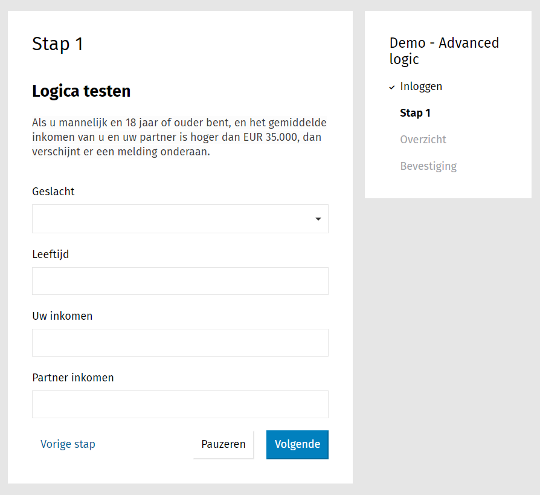

.. _example_advanced_logic:

=================================
Formulier met geavanceerde logica
=================================

In dit voorbeeld maken we een fictief formulier bestaande uit 1 stap, waarbij
meerdere velden worden gecontroleerd of aan bepaalde voorwaarden wordt voldaan.

In dit voorbeeld gaan we er van uit dat u een
:ref:`formulier met eenvoudige logica <example_logic_rules>` kan maken en dat
u op de hoogte bent van hoe :ref:`logica <manual_logic>` werkt.

.. note::

    U kunt dit voorbeeld downloaden en :ref:`importeren <manual_export_import>`
    in Open Formulieren.

    Download: :download:`advanced_logic.zip <_assets/advanced_logic.zip>`
