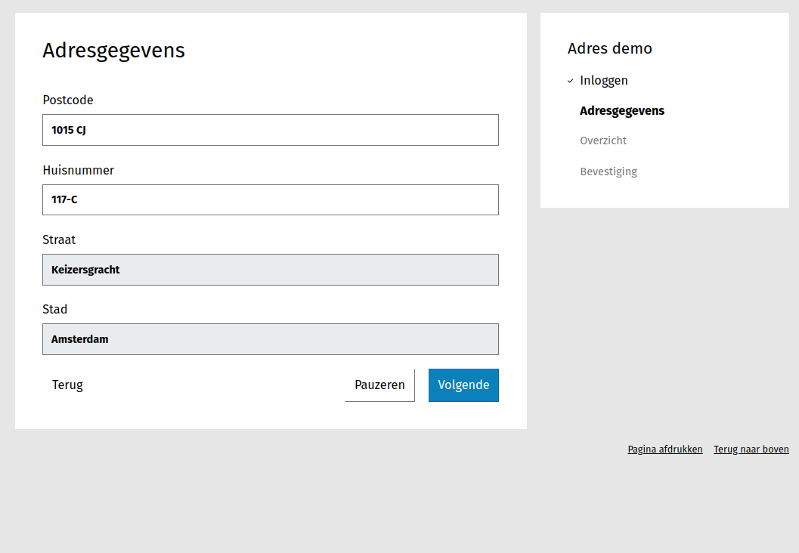

===========================
Adres automatisch aanvullen
===========================

.. warning::
   
   De oude functionaliteit (door gebruik te maken van een **Tekstveld** component)
   zal uitgefaseerd worden in een nieuwere versie. In plaats hiervan dient gebruik
   gemaakt te worden van het **addressNL** component, dat op dezelfde manier functioneert.

Configuratie (nieuwe versie)
============================

Eerst moet het volgende geconfigureerd worden:

* :ref:`BAG configuratie <configuration_prefill_bag>`: Voor het opzoeken van adressen.

Formulier maken
===============

1. Maak een formulier aan met de volgende waardes:

   **Naam** : Demo adres

2. Klik op de **Stappen en velden** tab.
3. Klik in het menu links op **Stap toevoegen** en kies **Maak een nieuwe formulierdefinitie**.
4. Voer de volgende waardes in onder **(Herbruikbare) stapgegevens**:

   **Naam** : Adresgegevens

5. Scroll naar **Velden**.
6. Klik op **Speciale velden** en sleep een **AddressNL** veld in het formulier:

   **Label** : AddressNL

7. Vink **Adres afleiden** aan en klik op **Opslaan**.
8. Klik linksonderaan op **Opslaan** om het formulier op te slaan.

Je kunt nu het formulier bekijken door in de lijst te klikken op **Toon formulier**

Het nieuwe **addressNL** component werkt op dezelfde manier als de oude aanpak met het **Tekstveld** component.
Door de verplichte gegevens in te voeren (postcode en huisnummer) worden de stad en straatnaam afgeleid en
automatisch ingevuld in de juiste velden.

In dit voorbeeld maken we een deel-formulier bestaande uit 1 stap, waarbij de
straatnaam en stad automatisch worden ingevuld zodra de postcode en huisnummer
zijn ingevuld.

In dit voorbeeld gaan we er van uit dat u een
:ref:`eenvoudig formulier <example_simple_form>` kan maken.

.. note::

    U kunt dit voorbeeld downloaden en :ref:`importeren <manual_export_import>`
    in Open Formulieren.

    Download: :download:`autofill_address_2.zip <_assets/autofill_address_2.zip>`

Configuratie (deprecated)
==========================

Voor dit formulier is bepaalde configuratie nodig. Hieronder staan de onderdelen
die geconfigureerd moeten zijn:

* :ref:`BAG configuratie <configuration_prefill_bag>`: Voor het opzoeken van adressen.

Formulier maken
===============

1. Maak een formulier aan met de volgende gegevens:

   * **Naam**: Adres demo

2. Klik op het tabblad **Stappen en velden**.
3. Klik aan de linkerkant op **Stap toevoegen** en selecteer **Maak een nieuwe
   formulierdefinitie**.
4. Onder de sectie **(Herbruikbare) stapgegevens** vul het volgende in:

    * **Naam**: Adresgegevens

5. Scroll naar de sectie **Velden**.
6. Sleep een **Postcode Field** component op het witte vlak, vul de volgende
   gegevens in en druk daarna op **Opslaan**:

   * **Label**: Postcode

7. Sleep een **Tekstveld** component op het witte vlak, vul de volgende
   gegevens in en druk daarna op **Opslaan**:

   * **Label**: Huisnummer

8. Sleep een **Tekstveld** component op het witte vlak, vul de volgende
   gegevens in en druk daarna op **Opslaan**:

   * **Label**: Straat

   Onder de **Location** tab:

     * **Straatnaam afleiden**: *Aangevinkt*
     * **Postcodecomponent**: ``Postcode (postcode)``
     * **Huisnummercomponent**: ``Huisnummer (huisnummer)``

9. Sleep een **Tekstveld** component op het witte vlak, vul de volgende
   gegevens in en druk daarna op **Opslaan**:

   * **Label**: Stad

   Onder de **Location** tab:

   * **Stad afleiden**: *Aangevinkt*
   * **Postcodecomponent**: ``Postcode (postcode)``
   * **Huisnummercomponent**: ``Huisnummer (huisnummer)``

10. Klik onderaan op **Opslaan** om het formulier volledig op te slaan.

U kunt nu het formulier bekijken.
