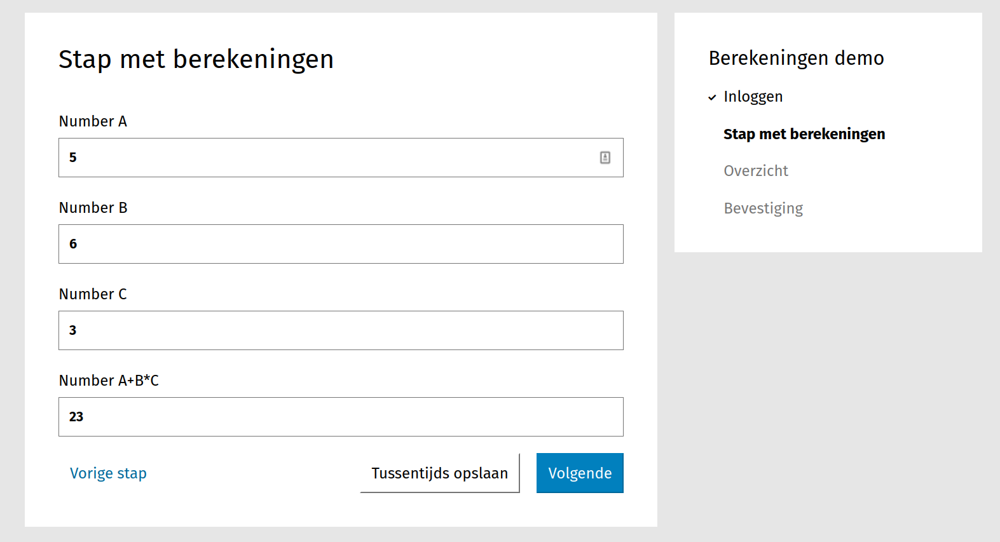

.. _examples_calculations:

==========================
Formulier met berekeningen
==========================

In dit voorbeeld maken we een fictief formulier bestaande uit 1 stap, waarbij
meerdere velden worden gebruikt voor berekeningen.

In dit voorbeeld gaan we er van uit dat u een
:ref:`formulier met eenvoudige logica <example_logic_rules>` kan maken en dat
u op de hoogte bent van hoe :ref:`logica <manual_logic>` werkt.

Formulier maken
===============

#. Maak een formulier aan met de volgende gegevens:

   * **Naam**: Berekeningen demo

#. Klik op het tabblad **Stappen en velden**.
#. Klik aan de linkerkant op **Stap toevoegen** en selecteer **Maak een nieuwe
   formulierdefinitie**.
#. Onder de sectie **(Herbruikbare) stapgegevens** vul het volgende in:

   * **Naam**: Stap met berekeningen

#. Scroll naar de sectie **Velden**.
#. Sleep een **Getal** component op het witte vlak, vul de volgende
   gegevens in en druk daarna op **Opslaan**:

   * **Label**: Number A

   Herhaal deze stap nog 2 keer, maar gebruik dan als label **Number B** en **Number C**.

#. Sleep een **Getal** component op het witte vlak, vul de volgende
   gegevens in en druk daarna op **Opslaan**:

   * **Label**: Number A+B*C

#. Druk daarna op **Opslaan en opnieuw bewerken**.

.. note::
    Berekeningen beperken zich niet alleen tot **Getal** componenten. Ook getallen in **Bedrag**, **Tekst** componenten en **Gebruikersvariabelen** kunnen worden gebruikt. 

#. Klik op het tabblad **Logica** en voeg een geavanceerde regel toe met de volgende trigger:

    .. code-block:: json

        {
          "or": [
            {
              "!=": [
                {
                  "var": "numberA"
                },
                null
              ]
            },
            {
              "!=": [
                {
                  "var": "numberB"
                },
                null
              ]
            },
            {
              "!=": [
                {
                  "var": "numberC"
                },
                null
              ]
            }
          ]
        }

    .. note::
        als ``numberA`` niet is ``null`` en ``numberB`` niet is ``null`` en ``numberC`` niet is ``null`` 

    en de volgende actie: **zet de waarde van een variabele**, **Number A+B\*C**, met de waarde:

    .. code-block:: json

        {
          "+": [
            {
              "var": "numberA"
            },
            {
              "*": [
                {
                  "var": "numberB"
                },
                {
                  "var": "numberC"
                }
              ]
            }
          ]
        }

   Deze actie vermenigvuldigt **Number B** en **Number C** en voegt de resultaat aan **Number A**.

U kunt nu het formulier bekijken. Als u waarden invult in de velden **Number A**, **Number B** en **Number C**
dan verschijnt het resultaat van de berekening in het veld **Number A+B\*C**

.. note::
    Als er decimalen worden gebruikt in de berekeningen is het vaak een goed idee om dit aantal te beperken in het resultaat veld. 
    Het aantal decimalen kan je instellen in de eigenschappen van een **Getal** component.
