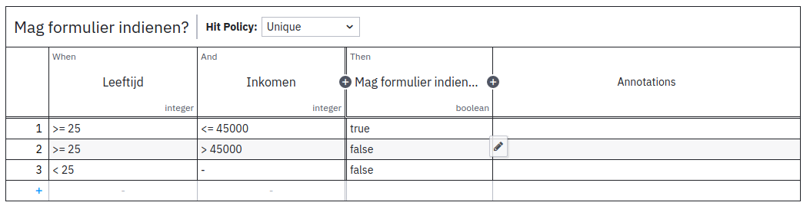

.. _examples_camunda:

======================================
Formulier met Camunda en DMN evaluatie
======================================

In dit voorbeeld maken we een fictief formulier bestaande uit 1 stap, waarbij een logica regel gebruik maakt van Camunda
om een beslistabel te evalueren.

Beslisdefinitie maken
==========================

Volg de `Camunda tutorial`_ om een beslisdefinitie aan te maken in de
`Camunda Modeller <https://camunda.com/download/modeler/>`_. De beslisdefinitie moet ID
**mag-formulier-indienen** en naam **Mag formulier indienen?** hebben. De beslistabel
moet de volgende input kolommen hebben:

#. **Leeftijd**:

   - Name: Leeftijd
   - Expression: leeftijd
   - Expression language: feel
   - Type: integer

#. **Inkomen**:

   - Name: Inkomen
   - Expression: inkomen
   - Expression language: feel
   - Type: integer

En de volgende output kolom:

#. **Mag formulier indienen?**

   - Name: Mag formulier indienen?
   - Expression: magFormulierIndienen
   - Expression language: feel
   - Type: boolean

Voeg deze regels toe:

Rol dan de beslisdefinitie uit op Camunda - in de Camunda Modeler doe je dit via het
raketicoon linksonder.

.. _Camunda tutorial: https://docs.camunda.org/get-started/dmn/model/

Formulier maken
===============

#. Maak een formulier aan met de volgende componenten in een formulierstap:

   * Getal-component met label **Leeftijd** en eigenschapsnaam **leeftijd**
   * Getal-component met label **Inkomen** en eigenschapsnaam **inkomen**

#. Maak een gebruikersvariabele aan met label **Mag formulier indienen?** en eigenschapsnaam **magFormulierIndienen**.
#. Maak een geavanceerde logica regelen aan waar de trigger ``true`` is (deze regel wordt altijd geëvalueerd).
#. Voeg een actie aan de regel toe, van type **Evalueer DMN** en klik op de **Instellen** knop.

   #. Selecter de plugin **Camunda 7**.
   #. Selecteer de **Mag formulier indienen?** beslisdefinitie.
   #. In de **Input Mapping** tabel, voeg twee variabelen toe:

      - **Leeftijd**: **leeftijd**
      - **Inkomen**: **inkomen**

   #. In de **Output Mapping** tabel, voeg een variabel toe:

      - **Mag formulier indienen?**: **magFormulierIndienen**

   #. Sla de configuratie op.

#. Voeg nog een advanced regel met:

   - Trigger: ``{"!": [{"var": "magFormulierIndienen"}]}``.
   - Actie van type **blokkeer doorgaan naar de volgende stap.**

   Deze regel blokkeert doorgaan naar de volgende stap in het geval dat ``magFormulierIndienen`` ``false`` is.

#. Sla het formulier op.

Formulier invullen
==================

Vul het formulier in met leeftijd 30 en inkomen 50000. De knop om naar de volgende stap te gaan is niet meer actief.
Verander het inkomen naar 20000. Nu is de knop weer actief.
