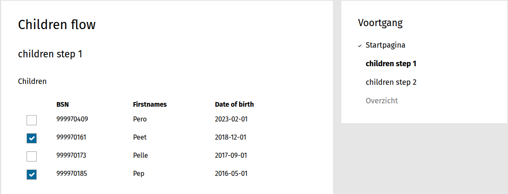
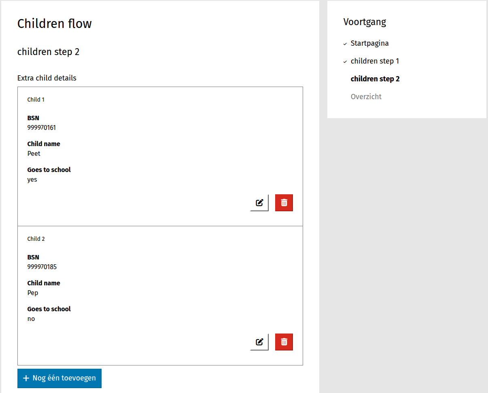

=====================
Children prefill flow
=====================

Configuration
==========================

First the following must be configured:

:ref:`Family members configuration <configuration_prefill_family_members>`: to retrieve
the children data.

Form
==============

1. Create a form with the name *Children flow*

2. In the **Authentication** fieldset on the **Form** tab, choose *Demo BSN*.

3. Click on the **Steps and fields** tab.

**Step 1**

4. In the menu on the left, add **Step** and choose **Create a new form definition**. Give
   the name *children step 1* and enable *Login required* .

5. Scroll to **fields**.

6. Click **Special fields** and drag a **children** field in the form.

7. In the properties of the first tab (*basic*) click on **Enable selection** (this 
   allows the user to select children during the form submission).

8. Click on **Save** to save the component.

**Step 2**

9. In the menu on the left, click **add step** and choose **Create a new form definition** 
   again. Give the name *children step 2*.

10. Scroll to **fields**.

11. Click **Special fields** and drag a **repeating group** field in the form. Give the 
    name *Extra child details* and click on **Save**.

12. From the **Special fields** drag a **BSN** field to the *Extra child details* repeating
    group. Mark it as a read-only field and click on **Save**.

13. Click on the form fields and drag a **Textfield** field to the *Extra child details*
    repeating group. Give it the name *Child name* and mark it as read-only field. Click
    on **Save**.

14. From the form fields drag a **Radio** field to the *Extra child details* repeating
    group. Give it the name *Goes to school* and add the values *yes* and *no* as the
    available options. Click on **Save**.

15. Click on **Save and continue editing** to save the form.

**Logic action**

16. Click on the **Logic** tab.

17. Click on the **Add rule** and choose the advanced one. The rule should be a simple *true*
    in order to always trigger the following action.

18. Click on the **Add action** and choose *Synchronize children* as an action.

19. Click on the **Configure** button to define the necessary configuration.

20. Select the *Children* component variable in the dropdown **From variable**.

21. Select the *Extra child details* component variable in the dropdown **To variable**.

22. Select the *BSN* component variable in the dropdown **Identifier variable**.

23. Click on the **Add variable** and select *BSN* for the variable dropdown and *bsn* 
    for the property dropdown.

24. Click again **Add variable** and do the same with the values *Child name* and *First names*.

25. Click on **Save** to save the configuration.

26. Click on **Save and continue editing** to save the form.

**User defined variable**

27. Define a user defined variable that will keep the retrieved data (children). The procedure
    is described here: :ref:`Family members configuration <configuration_prefill_family_members>`.
    Give the name *children immutable*.

28. Click on **Save** to save the form.

You can now view the form by clicking on the list **Show form**  in the Actions column of
the form list. The form consists of two steps, as mentioned above:

**Step 1**: shows the available (retrieved) children

**Step 2**: shows the selected children updated with the *BSN* and the *firstnames* of the
first step, along with the radio field which is the extra information provided manually
by the user 

