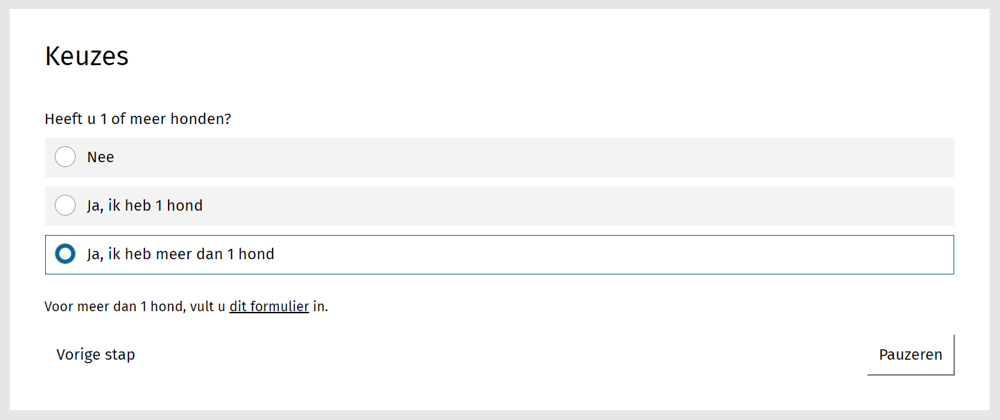

.. _examples_decision_tree:

==========
Beslisboom
==========

Soms dient een formulier alleen om te verwijzen naar een ander formulier of
bepaalde pagina's op de website, op basis van enkele gegevens.

In dit voorbeeld gaan we er van uit dat u een
:ref:`eenvoudig formulier <example_simple_form>` kan maken.

.. note::

    U kunt dit voorbeeld downloaden en :ref:`importeren <manual_export_import>`
    in Open Formulieren.

    Download: :download:`decision_tree_2.zip <_assets/decision_tree_2.zip>`

Formulier maken
===============

1. Maak een formulier aan met de volgende gegevens:

    * **Naam**: Beslisboom demo
    * **Toon voortgang**: Uitgevinkt
    * **Inzenden toegestaan**: Nee (zonder overzichtspagina)

2. Klik op het tabblad **Stappen en velden**.
3. Klik aan de linkerkant op **Stap toevoegen** en selecteer **Maak een nieuwe
   formulierdefinitie**.
4. Onder de sectie **(Herbruikbare) stapgegevens** vul het volgende in:

    * **Naam**: Keuzes

5. Scroll naar de sectie **Velden**.
6. Sleep een **Tekstveld** component op het witte vlak, vul de volgende
   gegevens in en druk daarna op **Opslaan**:

    * **Label**: Heeft u 1 of meer honden?
    * **Waarden**:

      ============================= =======
      Label                         Waarde
      ============================= =======
      Nee                           0
      Ja, ik heb 1 hond             1
      Ja, ik heb meer dan 1 hond    2
      ============================= =======

7. Onder de formulier velden, klik op **Opmaak**. Sleep een **Vrije tekst** 
   component op het witte vlak. Vul de volgende gegevens in en druk daarna op 
   **Opslaan**:

   * Tab **Weergave**
   
     * "U hoeft geen hondenbelasting te betalen."

   * Tab **Geavanceerd**
     
     * **Dit component moet worden weergegeven**: True
     * **Als het formulier component**: Heeft u 1 of meer honden? (heeftU1OfMeerHonden)
     * **De waarde heeft**: 0

8. Sleep nog een **Vrije tekst** component op het witte vlak. Vul de volgende 
   gegevens in en druk daarna op **Opslaan**:

   * Tab **Weergave**
   
     * "U betaalt voor 1 hond hondenbelasting. U kunt het formulier
       `hier <https://example.com>`__ invullen."

   * Tab **Geavanceerd**
     
     * **Dit component moet worden weergegeven**: True
     * **Als het formulier component**: Heeft u 1 of meer honden? (heeftU1OfMeerHonden)
     * **De waarde heeft**: 1

9. Sleep een laatste **Vrije tekst** component op het witte vlak. Vul de 
   volgende gegevens in en druk daarna op **Opslaan**:

   * Tab **Weergave**
   
     * "Voor meer dan 1 hond, vult u `dit formulier <http://example.com>`__ in." 

   * Tab **Geavanceerd**
     
     * **Dit component moet worden weergegeven**: True
     * **Als het formulier component**: Heeft u 1 of meer honden? (heeftU1OfMeerHonden)
     * **De waarde heeft**: 2

10. Klik onderaan op **Opslaan** om het formulier volledig op te slaan.

U kunt nu het formulier bekijken.
