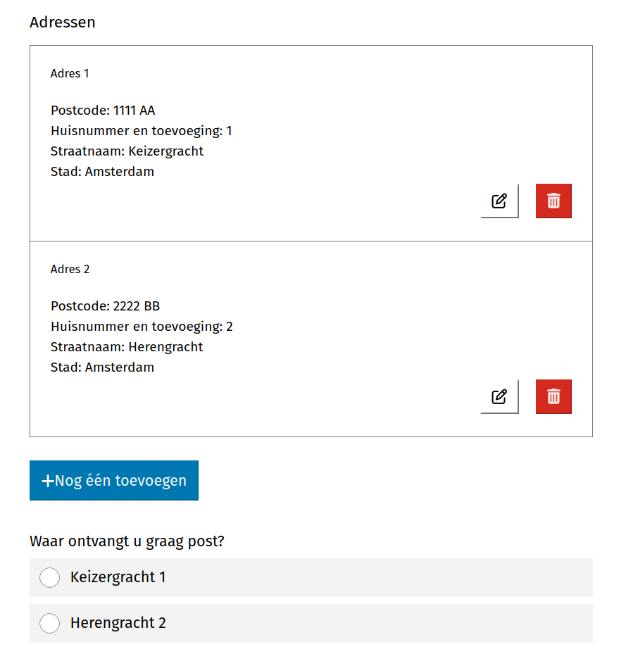
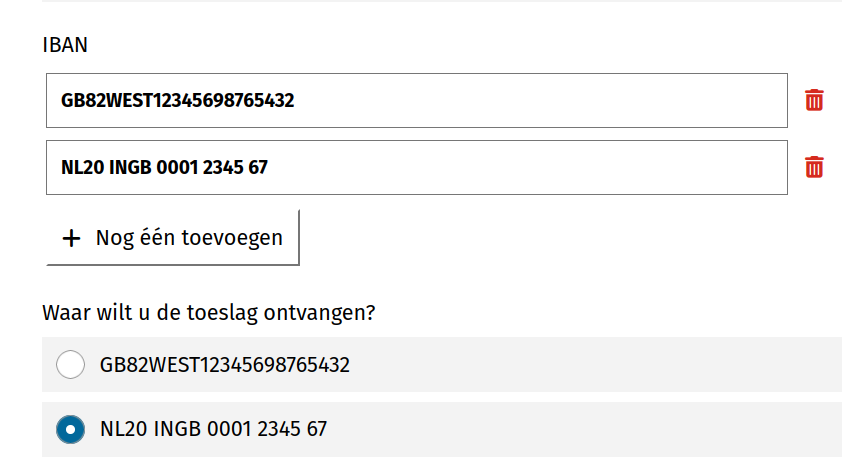

.. _example_logic_dynamic_options:

===============================
Formulier met dynamische opties
===============================

In dit voorbeeld maken we een deel-formulier bestaande uit 1 stap, waarbij
de opties van een "radio" component dynamisch worden aangepast afhankelijk van de ingevulde antwoorden van een ander
veld.

Deze functionaliteit kan op dezelfde manier worden gebruikt voor de "keuzelijst" component en de "selectievakjes"
component.

Formulier maken
===============

#. Maak een formulier aan met de volgende gegevens:

    * **Naam**: Toeslag aanvraag demo

#. Klik op het tabblad **Stappen en velden**.
#. Klik aan de linkerkant op **Stap toevoegen** en selecteer **Maak een nieuwe
   formulierdefinitie**.
#. Onder de sectie **(Herbruikbare) stapgegevens** vul het volgende in:

    * **Naam**: Persoonlijke gegevens

#. Scroll naar de sectie **Velden**.
#. Sleep een **Herhalende groep** component op het witte vlak, vul de volgende
   gegevens in en druk daarna op **Opslaan**:

   * **Label**: Adressen

#. Sleep deze componenten binnen de herhalende groep:

    #. **Postcode** component met label *Postcode*
    #. **Tekstveld** component met label *Huisnummer en toevoeging*
    #. **Tekstveld** component met label *Straatnaam*
    #. **Tekstveld** component met label *Stad*

#. Sleep een **radio** component op het witte vlak, vul de volgende
   gegevens in en druk daarna op **Opslaan**:

   * **Label**: Waar ontvangt u graag post?
   * **Data bron**: *variabele*
   * **Items**:

   .. code-block:: json

      {
         "map": [
            {"var": "adressen"},
            [
                {"cat": [{"var": "postcode"}, ",", {"var": "huisnummerEnToevoeging"}]},
                {"cat": [{"var": "straatnaam"}, " ", {"var": "huisnummerEnToevoeging"}, ", ", {"var": "plaatsnaam"}]}
            ]
         ]
      }

#. Sleep een **IBAN** component op het witte vlak, vul de volgende
   gegevens in en druk daarna op **Opslaan**:

   * **label**: IBAN
   * **Meerdere waarden**: aangevinkt

#. Sleep een **radio** component op het witte vlak, vul de volgende
   gegevens in en druk daarna op **Opslaan**:

   * **Label**: Waar wilt u de toeslag ontvangen?
   * **Data bron**: *variabele*
   * **Items**: ``{"var": "iban"}``

#. Klik onderaan op **Opslaan** om het formulier volledig op te slaan.

U kunt nu het formulier bekijken.

