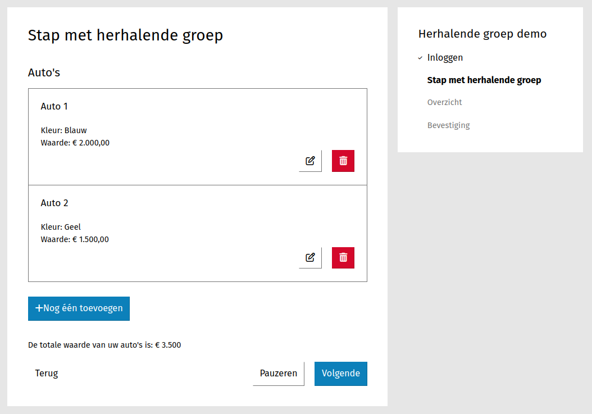

.. _examples_repeating_groups:

================================
Formulier met herhalende groepen
================================

In dit voorbeeld maken we een fictief formulier bestaande uit 1 stap met
een "herhalende groep"-component. We gaan berekeningen laten zien die gebruik maken van de waarden
die ingevuld zijn in de herhalende groepen.

In dit voorbeeld gaan we er van uit dat u een
:ref:`formulier met berekeningen <examples_calculations>` kan maken en dat
u op de hoogte bent van hoe :ref:`logica <manual_logic>` werkt.

Formulier maken
===============

#. Maak een formulier aan met de volgende gegevens:

   * **Naam**: "Herhalende groep"-demo

#. Klik op het tabblad **Stappen en velden**.
#. Klik aan de linkerkant op **Stap toevoegen** en selecteer **Maak een nieuwe
   formulierdefinitie**.
#. Onder de sectie **(Herbruikbare) stapgegevens** vul het volgende in:

   * **Naam**: Stap met herhalende groep

#. Scroll naar de sectie **Velden** en klik op **Speciale velden**.
#. Sleep een **Herhalende groep** component op het witte vlak, vul de volgende
   gegevens in en druk daarna op **Opslaan**:

   * **Basis** > **Label**: _`Auto's`
   * **Basis** > **Groepslabel**: _`Auto`

   .. note::

      Het Groepslabel is het label dat boven iedere herhaalde groep weergegeven wordt in de overzichtspagina, inzendings-PDF en bevestigingsmail + 1.

#. Klik op **Formuliervelden** en sleep een **Tekstveld** component binnen de herhalende groep. Vul de volgende
   gegevens in en druk daarna op **Opslaan**:

   * **Label**: Kleur

#. Sleep een **Bedrag** component binnen de herhalende groep. Vul de volgende
   gegevens in en druk daarna op **Opslaan**:

   * **Label**: Waarde

#. Klik op **Opmaak** en sleep een "vrije tekst"-component op het witte vlak. Vul de volgende gegevens in:

   * Onder **Vrije tekst** component: ``De totale waarde van uw auto's is: €{{ totaleWaarde|localize }}``
   * **Verborgen**: *aangevinkt*

#. Druk daarna op **Opslaan en opnieuw bewerken**.
#. Klik op het tabblad **Variabelen** en daarna op het tabblad **User defined**.
#. Voeg een variabele toe met de volgende gegevens:

   * **Naam**: Aantal auto's
   * **Data type**: Kommagetal/float

#. Voeg nog een variabele toe met de volgende gegevens:

   * **Naam**: Totale waarde
   * **Data type**: Kommagetal/float

#. Klik op het **Logica** tabblad en voeg een geavanceerde regel met de de volgende gegevens:

   * Trigger: ``{"!!": [true]}``
   * Acties:

     * **Wijzig de waarde van een variabele** > **Totale waarde** >

     .. code-block:: json

        {
            "reduce": [
                {"var": "autos"},
                {"+": [{"var": "accumulator"}, {"var": "current.waarde"}]},
                0
            ]
        }

     .. note::

        De variabele ``autos`` moet overeenkomen met de eigenschapsnaam van het :ref:`"herhalende groep"-component<Auto's>`.
        De variabelen ``accumulator`` en ``current`` refereren binnen de ``reduce`` functie naar respectievelijk de
        resultaatwaarde en de huidige groep.
        Binnen een groep kunnen we weer verwijzen naar een individueel component.
        Hier wordt dat bijvoorbeeld gedaan naar het component met de eigenschapsnaam ``waarde``.

     * **Wijzig de waarde van een variabele** > **Aantal auto's** >

     .. code-block:: json

        {"reduce": [{"var": "autos"}, {"+": [{"var": "accumulator"}, 1]}, 0]}

    .. note::

       Hier wordt bijna hetzelfde gedaan als hierboven, maar in plaats van de ``waarde`` tellen we nu steeds het
       getal ``1`` op per iteratie om tot het totale aantal te komen.

#. Voeg een eenvoudige regel toe met de volgende gegevens:

   * Trigger: Als **Aantal auto's (aantalAutos)** > **is groter dan** > **de waarde** > ``0``
   * Actie: dan **wijzig een attribuut van een veld/component** > **Stap met herhalende groep: Content (content)**
     > **Verborgen** > **Nee**

#. Klik op opslaan

U kunt nu het formulier bekijken.

.. image:: _assets/repeating_groups_fill_form_2.png
    :width: 51%

