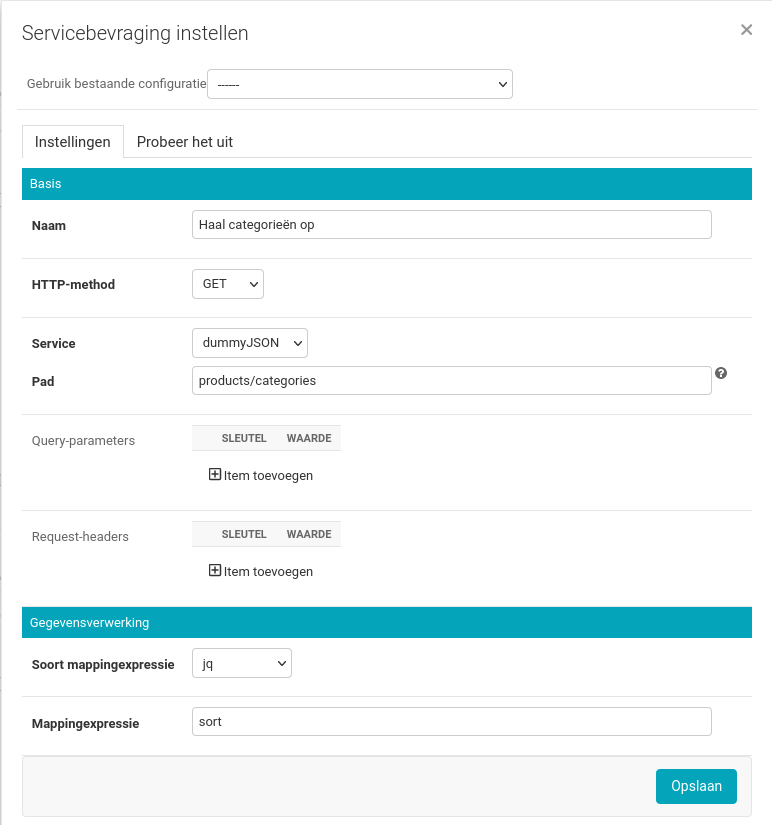
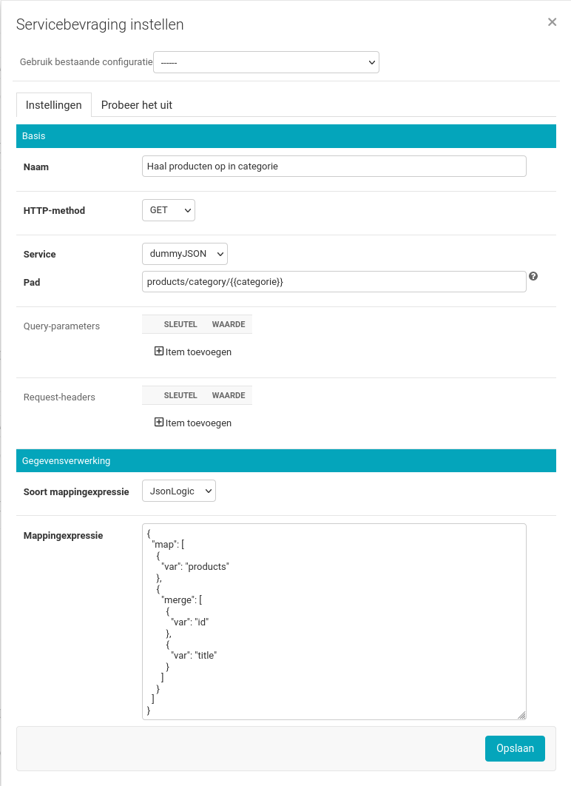
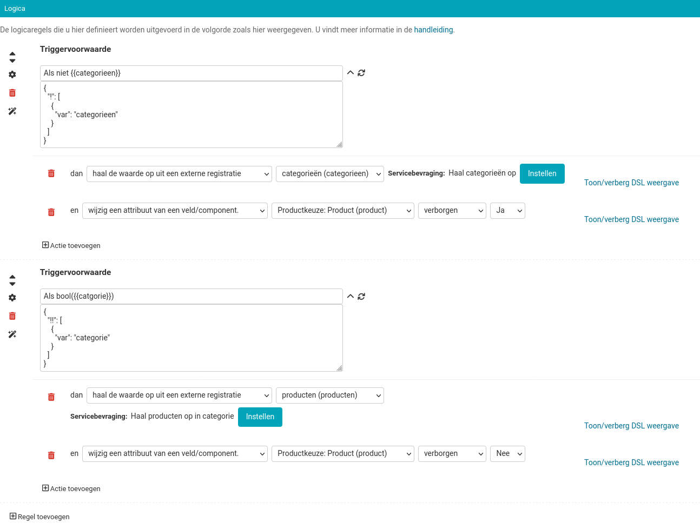

.. _example_service_fetch:

==============================================
Formulier met waarden uit externe registraties
==============================================

In dit voorbeeld maken we een deel van een formulier bestaande uit één stap. De
uitgangspunten zijn:

* de `dummyjson-service`_ bied een lijst van productcategorieën aan
* de service biedt ook een lijst van producten aan, per categorie
* na selectie van een categorie halen we de beschikbare producten uit die
  categorie op

De keuzelijsten voor categorieën en producten worden dus dynamisch opgebouwd op
basis van data uit een externe service.

We gaan ervan uit dat u een :ref:`formulier met geavanceerde logica
<example_advanced_logic>` kunt maken.

Service aanmaken
================

.. note:: Het kan zijn dat je onvoldoende rechten hebt om services aan te maken. Indien
   je deze rechten niet hebt, vraag dan aan een functioneel beheerder om de
   :ref:`service in te stellen <configuration_general_external_services>`.

#. Navigeer in de beheeromgeving naar **Configuratie** > **Services**.

#. Klik op de **Service toevoegen** knop.

#. Vul de formuliervelden in:

    * **Label**: ``dummyJSON``
    * **OAS URL**: ``https://tinyurl.com/dummyjson-oas``
    * **Type**: ``ORC (Overige)``
    * **API root url**: ``https://dummyjson.com/``
    * **Authorization type**: ``No authorization``

#. Klik op **Opslaan**.

Formulier maken
===============

#. Maak een formulier aan met de volgende gegevens:

    * **Naam**: Productaanvraag

#. Klik op het tabblad **Stappen en velden**.
#. Klik aan de linkerkant op **Stap toevoegen** en selecteer **Maak een nieuwe
   formulierdefinitie**.
#. Onder de sectie **(Herbruikbare) stapgegevens** vul het volgende in:

    * **Naam**: Productkeuze

#. Sleep een **Keuzelijst** component op het witte vlak, vul de volgende
   gegevens in en druk daarna op **Opslaan**:

    * **Label**: Categorie
    * Scroll naar beneden en selecteer bij **Keuzeopties** ``variabele``
    * Vul bij **Opties-expressie** het volgende in:

    .. code-block:: json

      {"var": "catagorieen"}

#. Sleep een **Keuzelijst** component op het witte vlak, vul de volgende
   gegevens in en druk daarna op **Opslaan**:

    * **Label**: Product
    * Scroll naar beneden en selecteer bij **Keuzeopties** ``variabele``
    * Vul bij **Opties-expressie** het volgende in:

    .. code-block:: json

      {"var": "producten"}

#. Klik op de **Variabelen** tab in het formuliermenu en vervolgens op de **Gebruikersvariabelen** tab

#. Klik op **Variabele toevoegen**
#. Voer bij **Naam** ``Categorieën`` in en kies bij **Datatype** ``Lijst (array)``
#. Klik op **Variabele toevoegen**
#. Voer bij **Naam** ``Producten`` in en kies bij **Datatype** ``Lijst (array)``

#.  Klik op de **Logica** tab in het formuliermenu
#.  Klik op **Regel toevoegen**, gevolgd door **Geavanceerd**.
#.  Vul bij **Triggervoorwaarde** deze JsonLogic in:

    .. code-block:: json

      {"!": [{"var": "categorieen"}]}

#.  Klik op **Actie Toevoegen** en selecteer

    * dan **haal de waarde op uit een externe registratie**
    * **Categorieën (categorieen)**
    * Klik op **Instellen**

      * Vul bij **Naam** ``Haal categorieën op`` in
      * Selecteer bij **HTTP-method** ``GET``
      * Selecteer bij **Service** ``dummyJSON``
      * Vul bij **Pad** ``products/categories`` in
      * Selecteer bij **Soort mappingexpressie** ``jq``
      * Vul bij **Mappingexpressie** ``sort`` in

    * Klik op **Opslaan**

    .. note::

        Omdat het antwoord van de dummyJSON service ongesorteerd is, gebruiken
        we de `jq sort functie`_, zodat de opties in de keuzelijst op
        alfabetische volgorde komen.

        |fetch_categories|

        Deze actie betekent: als ``categorieen`` leeg is, bevraag dan de dummyJSON
        service voor ``products/categories``, sorteer het antwoord en sla deze
        lijst van strings op in de variabele``categorieen``.

#.  Klik op **Regel toevoegen**, gevolgd door **Geavanceerd**.
#.  Vul bij **Triggervoorwaarde** deze JsonLogic in:

    .. code-block:: json

      {"!!": [{"var": "categorie"}]}

#.  Klik op **Actie Toevoegen** en selecteer

    * dan **haal de waarde op uit een externe registratie**
    * **Producten (producten)**
    * Klik op **Instellen**

      * Vul bij **Naam** ``Haal producten in categorie op`` in
      * Selecteer bij **HTTP-method** ``GET``
      * selecteer bij **Service** ``dummyJSON``
      * Vul bij **Pad** ``products/category/{{ categorie }}`` in
      * Selecteer bij **Soort mappingexpressie** ``JsonLogic``
      * Vul bij **Mappingexpressie** het volgende in:

      .. code-block:: json

        {"map": [
          {"var": "products"},
          {"merge": [ {"var": "id"}, {"var": "title"} ]}
        ]}

    * Klik op **Opslaan**

    .. note::

       |fetch_products|

       Deze actie betekent: als er een ``categorie`` is gekozen, bevraag dan de
       dummyJSON service voor ``products/category/{{ categorie }}`` met de
       gekozen categorie in het pad, neem van elk product object in het
       ``products`` attribuut van het antwoord, de ``id`` en ``title`` en sla
       de resulterende lijst van lijsten van 2 strings op in de
       variabele``producten``.

#.  Klik onderaan op **Opslaan** om het formulier volledig op te slaan.

U kunt nu het formulier bekijken.

Eventueel kunt u extra acties aan de regels toevoegen, zodat de ``Product``
keuzelijst alleen zichtbaar is wanneer er een categorie gekozen is:

|logic|

.. warning::

   Het bevragen van services kost tijd en kan de formulierlogica vertragen,
   omdat er op antwoorden gewacht moet worden. Probeer door handig gebruik van
   variabelen en triggers, deze bevragingen tot een minimum te beperken.

   "Bevragen registraties" is geschikt voor gebruik, maar nog onvolledig.
   Bekende missende of beperkte functionaliteiten zijn onder andere:

   * `het "Probeer het uit" tabje <https://github.com/open-formulieren/open-forms/issues/2777>`_
   * `export/import <https://github.com/open-formulieren/open-forms/issues/2683>`_
   * `slimme caching <https://github.com/open-formulieren/open-forms/issues/2688>`_
   * en `meer <https://github.com/open-formulieren/open-forms/labels/topic%3A%20hergebruik%20waarden>`_

   Door de agile aard van de ontwikkeling staan deze issues op het moment
   **niet** op een roadmap.

   Daarnaast kan de manier van invoegen van formulierdata in de bevragingen van
   syntax veranderen. Op dit moment kunt u met de bekende ``{{ variabelesleutel
   }}`` syntaxis, waarden invoegen in

   * Pad
   * **waarden** van Query-parameters (niet de *sleutels*)
   * **waarden** van Request-headers (niet de *sleutels*)
   * Body

.. _dummyjson-service: https://dummyjson.com/docs
.. _jq sort functie: https://jqlang.github.io/jq/manual/#sort-sort_by
