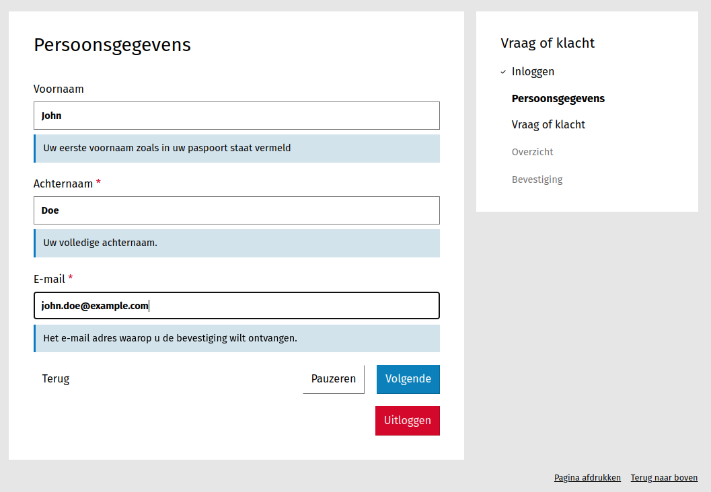
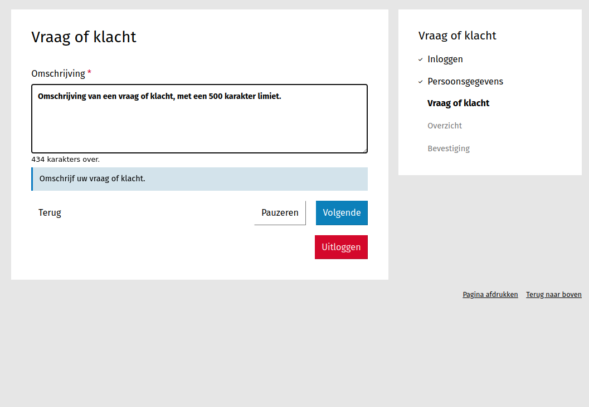
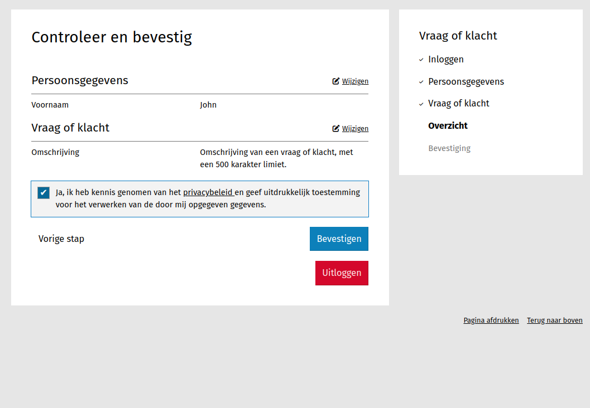
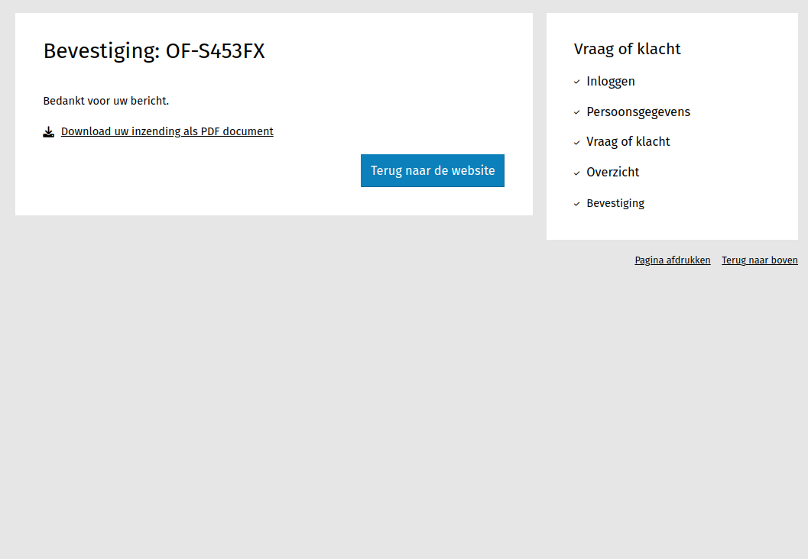

.. _example_simple_form:

===================
Eenvoudig formulier
===================

In dit voorbeeld maken we een formulier bestaande uit 2 stappen, waarbij de 
gebruiker dient in te loggen met *DigiD simulatie*. Ingezonden formulieren
worden opgeslagen in Open Formulieren zelf en niet doorgestuurd naar een 
registratie systeem.

.. note::
    U kunt dit voorbeeld downloaden en :ref:`importeren <manual_export_import>`
    in Open Formulieren.
    Download: :download:`simple_form_2.zip <_assets/simple_form_2.zip>`

Formulier maken
===============

1. Navigeer naar **Formulieren** > **Formulieren**.
2. Klik op **Formulier toevoegen**
3. Vul de volgende gegevens in onder het tabblad **Formulier**:

    * **Naam**: Vraag of klacht 
    * **Inlogopties** > **DigiD simulatie**: *Aangevinkt*

    De andere gegevens staan standaard goed. Als het goed is is het **URL-deel**
    automatisch ingevuld met *vraag-klacht*, op basis van het **Naam** veld.

4. Klik op het tabblad **Stappen en velden**.
5. Klik aan de linkerkant op **Stap toevoegen** en selecteer **Maak een nieuwe 
   formulierdefinitie**.
6. Onder de sectie **(Herbruikbare) stapgegevens** vul het volgende in:
   
    * **Naam**: Persoonsgegevens
    * **Vereist authenticatie**: *Aangevinkt*

7. Scroll naar de sectie **Velden**.
8. Sleep een **Tekstveld** component van de kolom aan de linkerkant, naar 
   rechts op het witte vlak, bovenin. Als een doorzichtige versie van 
   **Tekstveld** zichtbaar wordt kunt u de muisknop loslaten.
9.  Er verschijnt een een popup genaamd **Text Field Component**.
10. Vul de volgende gegevens in onder In het tabblad **Basic**:

    * **Label**: Voornaam
    * **Beschrijving**: Uw eerste voornaam zoals in uw paspoort staat vermeld.
    * **Weergeven in bevestigingsmail**: *Aangevinkt*

11. Klik op **Opslaan**. Het component is nu toegevoegd aan de formulier definitie.
12. Sleep een nieuw **Tekstveld** component op het witte vlak, vul de volgende 
    gegevens in en druk daarna op **Opslaan**.

    * **Basic** tab:

      * **Label**: Achternaam
      * **Beschrijving**: Uw volledige achternaam.
      * **Weergeven in bevestigingsmail**: *Aangevinkt*

    * **Validatie** tab:

      * **Verplicht**: *Aangevinkt*

.. note::
    Je herkend velden die verplicht zijn aan de **dik** gedrukte labels
    
    .. image:: _assets/simple_form_2_5.png
 

13. Sleep een **Email** component op het witte vlak, vul de volgende gegevens 
    in en druk daarna op **Opslaan**.

    * **Basic** tab:

      * **Label**: E-mail
      * **Beschrijving**: Het e-mail adres waarop u de bevestiging wilt ontvangen.
      * **Ontvangt bevestigingsmail**: *Aangevinkt*

    * **Validatie** tab:

      * **Verplicht**: *Aangevinkt*

14. Klik aan de linkerkant op **Stap toevoegen** en selecteer **Maak een nieuwe 
    formulierdefinitie**.

15. Onder de sectie **(Herbruikbare) stapgegevens** vul het volgende in:
   
    * **Naam**: Vraag of klacht

16. Scroll naar de sectie **Velden**.
17. Sleep een **Tekstvlak** component op het witte vlak, vul de volgende 
    gegevens in en druk daarna op **Opslaan**.

    * **Basic** tab:

      * **Label**: Omschrijving
      * **Beschrijving**: Omschrijf uw vraag of klacht.
      * **Weergeven in bevestigingsmail**: *Aangevinkt*
      * **Toon aantal karakters**: *Aangevinkt*

    * **Validatie** tab:

      * **Verplicht**: *Aangevinkt*
      * **Maximum Length**: 500

18. Klik op het tabblad **Bevestiging**.
19. Vul bij **Inhoud bevestigingspagina** in: Bedankt voor uw bericht.
20. Klik onderaan op **Opslaan** om het formulier volledig op te slaan.

U kunt nu het formulier bekijken door rechtsboven de knop "TOON FORMULIER" te gebruiken. 

.. warning::
    Door het gebruik van de DigiD simulatie plugin is dit formulier alleen te gebruiken als je bent ingelogd als beheerder.