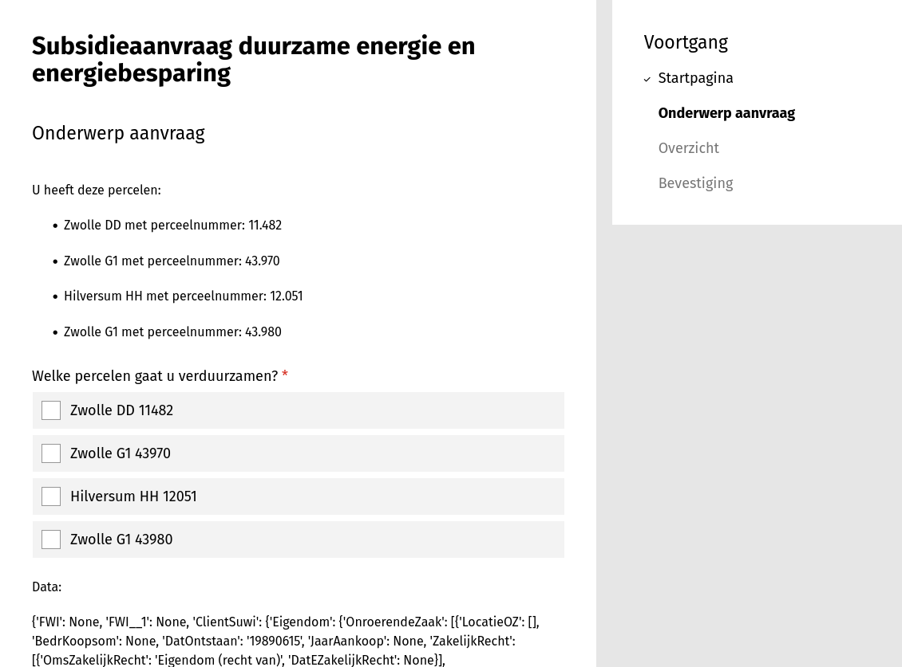

.. _example_suwinet:

=================================
Formulier met waarden uit Suwinet
=================================

In dit voorbeeld verwerken we informatie die via :ref:`Suwinet
<configuration_prefill_suwinet>` uit het Kadaster komt tot keuzeopties voor keuzevakjes.
We maken daarvoor de `kadastrale aanduiding`_, die de een perceel uniek identificeert.

De Suwinet plugin gebruikt het BSN van de invuller om informatie op te halen, daarom is
het vereist om een :ref:`Authenticatie plugin <configuration_authentication_index>` te
gebruiken die een BSN aanbiedt.

We gaan ervan uit dat u een :ref:`formulier met geavanceerde logica
<example_advanced_logic>` kunt maken.

.. _kadastrale aanduiding: https://nl.wikipedia.org/wiki/Kadastrale_aanduiding

Formulier maken
===============

#. Maak een formulier aan met de volgende gegevens:

   * **Naam**: Subsidieaanvraag duurzame energie en energiebesparing
   * **Authenticatiemethode**: Een methode die BSN aanbiedt. Bijv. *Demo BSN(test)*

#. Klik op het tabblad **Stappen en velden**.
#. Klik aan de linkerkant op **Stap toevoegen** en selecteer **Maak een nieuwe
   formulierdefinitie**.
#. Onder de sectie **(Herbruikbare) stapgegevens** vul het volgende in:

   * **Naam**: Onderwerp aanvraag
   * Vink **Vereist authenticatie** aan

#. Sleep een **Vrije tekst** component op het witte vlak en vul de volgende tekst in:

   .. code-block:: django

     U heeft deze percelen:

     

     {{perceel.KadastraleAanduiding.KadastraleGemeentenaam}} {{perceel.KadastraleAanduiding.KadastraleSectie}} met perceelnummer: {{perceel.KadastraleAanduiding.KadastraalPerceelnr}}

     

   .. image:: _assets/suwinet_free_text.png

#. Sleep een **Selectievakjes** component onder het vrije-tekst-component, vul de volgende
   gegevens in en druk daarna op **Opslaan**:

   * **Label**: Welke percelen gaat u verduurzamen?
   * Scroll naar beneden en selecteer bij **Keuzeopties** ``variabele``
   * Vul bij **Opties-expressie** het volgende in:

   .. code-block:: json

     {"map": [
         {"var": "onroerendeZaken.ClientSuwi.Eigendom.OnroerendeZaak"},
         {"cat": [
           {"var": "KadastraleAanduiding.KadastraleGemeentenaam"},
           " ",
           {"var": "KadastraleAanduiding.KadastraleSectie"},
           " ",
           {"var": "KadastraleAanduiding.KadastraalPerceelnr"}
         ]}
     ]}

   .. image:: _assets/suwinet_field.png

#. Klik op de **Variabelen** tab in het formuliermenu en vervolgens op de **Gebruikersvariabelen** tab

#. Klik op **Variabele toevoegen**
#. Voer bij **Naam** ``Onroerende Zaken``
#. Kies bij **Prefill-plugin** ``Suwinet``
#. Kies bij **Prefill-attribuut** ``KadasterDossierGSD > PersoonsInfo``
#. Kies bij **Datatype** ``Sleutel-waardepaar (object)``
#. Vink **Gevoelige gegevens** aan.

   .. image:: _assets/suwinet_vars.png

De testdata van het Kadaster bevat voor BSN ``111111110`` zaken in Zwolle. Wanneer we
met dat BSN inloggen op het formulier zal het er zo uit zien:

.. note::
   TIP: Je kunt een **Vrije tekst** component uit de **Opmaak** categorie gebruiken om de
   structuur van het antwoord object in te zien::

      Data:
      {{onroerendeZaken}}

