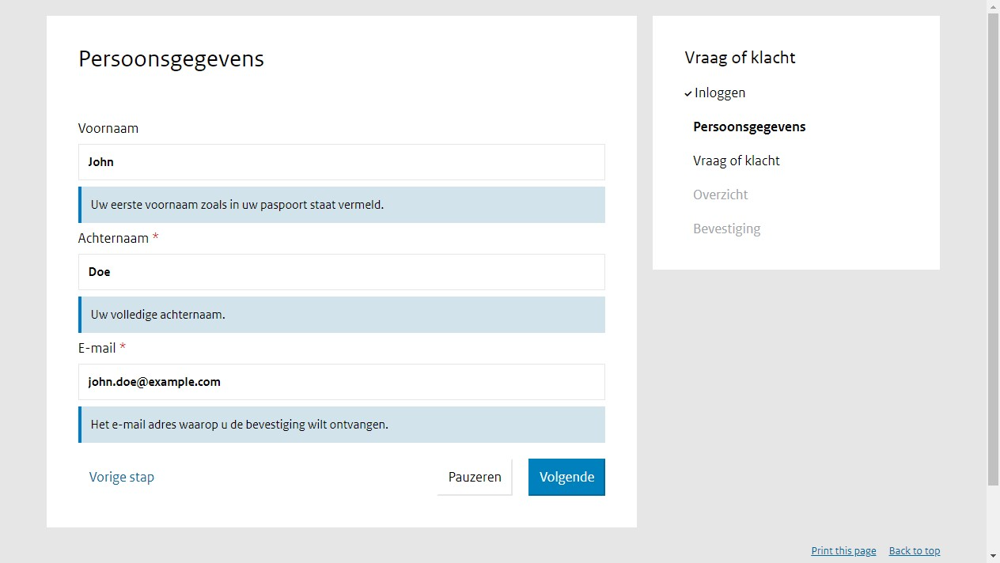
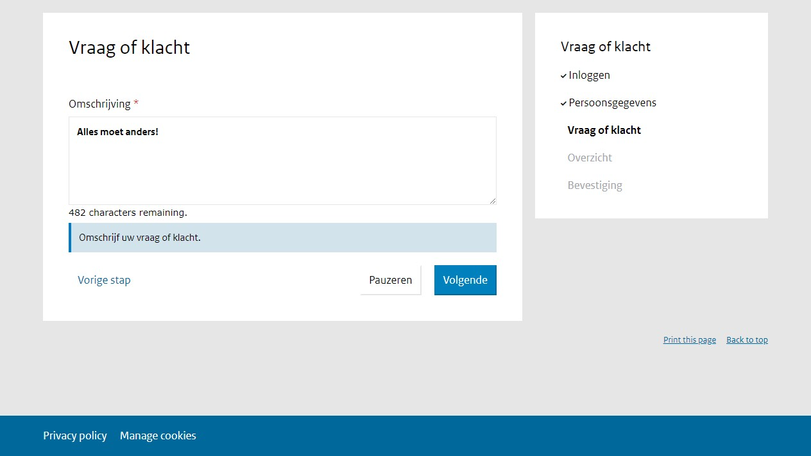
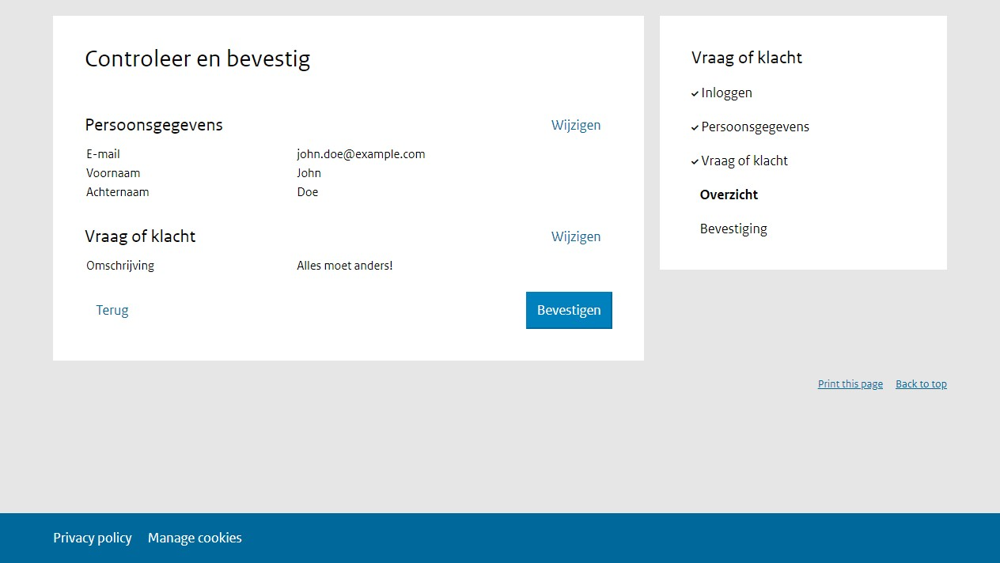

===========
Voorbeelden
===========

Mijn eerste formulier
=====================

In dit voorbeeld maken we een formulier bestaande uit 2 stappen, waarbij de 
gebruiker dient in te loggen met *DigiD simulatie*. Ingezonden formulieren
worden opgeslagen in Open Formulieren zelf en niet doorgestuurd naar een 
registratie systeem.

.. image:: _assets/tutorial_4.png
    :width: 24%

Formulier maken
---------------

1. Navigeer naar **Formulieren** > **Formulieren**.
2. Klik op **Formulier toevoegen**
3. Vul de volgende gegevens in onder het tabblad **Formulier**:

    * **Naam**: Vraag of klacht 
    * **Inlogopties** > **DigiD simulatie**: *Aangevinkt*

    De andere gegevens staan standaard goed. Als het goed is is het **URL-deel**
    automatisch ingevuld met *vraag-of-klacht*, op basis van het **Naam** veld.

4. Klik op het tabblad **Stappen en velden**.
5. Klik aan de linkerkant op **Stap toevoegen** en selecteer **Maak een nieuwe 
   formulierdefinitie**.
6. Onder de sectie **(Herbruikbare) stapgegevens** vul het volgende in:
   
    * **Naam**: Persoonsgegevens
    * **Inloggen vereist?**: *Aangevinkt*

7. Scroll naar de sectie **Velden**.
8. Sleep een **Text Field** component van de kolom aan de linkerkant, naar 
   rechts op het witte vlak, bovenin. Als een doorzichtige versie van 
   **Text Field** zichtbaar wordt kunt u de muisknop loslaten.
9.  Er verschijnt een een popup genaamd **Text Field Component**.
10. Vul de volgende gegevens in onder In het tabblad **Basic**:

    * **Label**: Voornaam
    * **Description**: Uw eerste voornaam zoals in uw paspoort staat vermeld.
    * **Show in email**: *Aangevinkt*

11. Klik op **Save**. Het component is nu toegevoegd aan de formulier definitie.
12. Sleep een nieuw **Text Field** component op het witte vlak, vul de volgende 
    gegevens in en druk daarna op **Save**.

    * **Basic** tab:

      * **Label**: Achternaam
      * **Description**: Uw volledige achternaam.
      * **Show in email**: *Aangevinkt*

    * **Validation** tab:

      * **Required**: *Aangevinkt*

13. Sleep een **Email** component op het witte vlak, vul de volgende gegevens 
    in en druk daarna op **Save**.

    * **Basic** tab:

      * **Label**: E-mail
      * **Description**: Het e-mail adres waarop u de bevestiging wilt ontvangen.
      * **Receives confirmation email**: *Aangevinkt*

    * **Validation** tab:

      * **Required**: *Aangevinkt*

14. Klik aan de linkerkant op **Stap toevoegen** en selecteer **Maak een nieuwe 
    formulierdefinitie**.

15. Onder de sectie **(Herbruikbare) stapgegevens** vul het volgende in:
   
    * **Naam**: Vraag of klacht

16. Scroll naar de sectie **Velden**.
17. Sleep een **Text Area** component op het witte vlak, vul de volgende 
    gegevens in en druk daarna op **Save**.

    * **Basic** tab:

      * **Label**: Omschrijving
      * **Description**: Omschrijf uw vraag of klacht.
      * **Show in email**: *Aangevinkt*
      * **Show Character Counter**: *Aangevinkt*

    * **Validation** tab:

      * **Required**: *Aangevinkt*
      * **Maximum Length**: 500

18. Klik op het tabblad **Bevestiging**.
19. Vul bij **Inhoud bevestigingspagina** in: Bedankt voor uw bericht.
20. Klik onderaan op **Opslaan** om het formulier volledig op te slaan.

U kunt nu het formulier bekijken.
