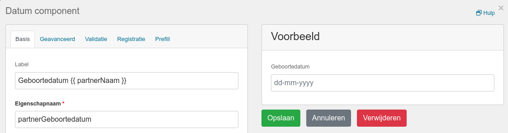
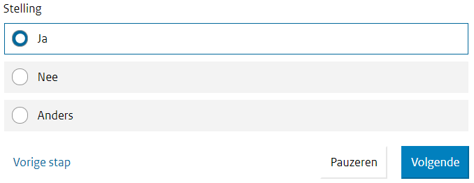
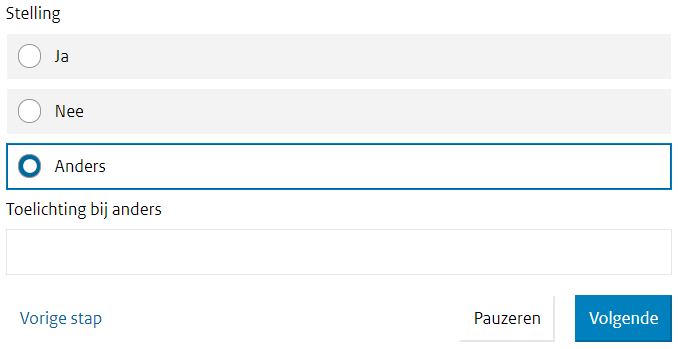

.. _manual_form_fields:

===============
Formuliervelden
===============

Alle velden in een formulier zijn van een bepaald type, het veld type.

Algemeen
========

Veel veld typen (ook wel componenten genoemd) hebben soortgelijke opties en
functies. Hieronder staan de meest voorkomende genoemd, onderverdeeld in de
tabbladen binnen het component.

Basis
-----

* **Label**: Het label bij het veld dat zichtbaar is voor de eindgebruiker.
* **Eigenschapnaam**: De interne naam van het veld. Deze naam wordt gebruikt om
  eenduidig naar dit veld te verwijzen vanuit andere velden of in
  :ref:`sjablonen <manual_templates>`.
* **Beschrijving**: Een optionele help tekst bij het veld.
* **Weergeven in bevestigingsmail**: Indien aangevinkt, dan wordt dit veld opgenomen in de
  bevestigingsmail naar de eindgebruiker.
* **Verborgen**: Indien aangevinkt, dan is het veld onzichtbaar voor de
  eindgebruiker. Dit kan bijvoorbeeld gebruikt worden om informatie voor in te
  vullen en door te zetten naar achterliggende registratiesystemen. Beheerders
  kunnen de waarden van onzichtbare velden uiteraard wel zien.

.. _manual_forms_form_fields_variables_usage:

Variabelen
~~~~~~~~~~

Je kan :ref:`variabelen <manual_forms_variables>` gebruiken in het ontwerp van
formulieren, bijvoorbeeld om een (voor-)ingevulde naam in het label van een ander
formulierveld weer te geven. Hiervoor is de
:ref:`sjabloonfunctionaliteit <manual_templates>` beschikbaar.

.. note::

    Je kan hier de component-, vaste en/of gebruikersvariabelen gebruiken. Eventuele
    registratievariabelen zijn niet beschikbaar.

Stel dat je een formulier hebt met de volgende velden:

* Voornaam partner (met eigenschapnaam ``partnerNaam``)
* Achternaam partner (met eigenschapnaam ``partnerAchternaam``)

Dan kun je een veld toevoegen met:

* **Eigenschapnaam**: ``partnerGeboortedatum``
* **Label**: ``Geboortedatum {{ partnerNaam }}``

Wanneer eindgebruiker dan als voornaam "Willy" invult, dan wordt het label voor de
geboortedatum "Geboortedatum Willy". Merk op dat dit niet beschikbaar is in de
formulierdesigner, enkel bij het daadwerkelijk invullen van een formulier.

Deze functionaliteit is beschikbaar op de volgende opties:

* **Label**
* **Standaardwaarde**
* **Beschrijving**
* **Placeholder**
* **Inhoud** bij vrije-tekst

Geavanceerd
-----------

* **This component should Display**: Selecteer ``True`` om het veld te tonen als
  onderstaande conditie geldt. Selecteer ``False`` om het veld juist te
  verbergen als onderstaande conditie geldt.
* **When the form component**: Selecteer een ander veld dat een specifieke
  waarde moet hebben om dit veld te tonen of te verbergen.
* **Has the value**: De waarde die het andere veld moet hebben om de conditie te
  laten slagen.

**Voorbeeld**

Stel er zijn 2 velden:

* Een *Radio* ``Stelling`` met als *Eigenschapnaam* ``stelling``, en 3 waarden:
  ``ja``, ``nee`` en ``anders``.
* Een *Text Field* ``Toelichting bij anders``. Dit veld wordt als volgt
  ingesteld:

  * **This component should Display**: ``True``
  * **When the form component**: ``stelling``
  * **Has the value**: ``anders``

Er is nu een formulier gemaakt waarbij het tekstveld ``Toelichting bij anders``
alleen zichtbaar wordt indien als ``Stelling`` de waarde ``anders`` is gekozen.

.. _manual_form_fields_validation:

Validatie
---------

* **Verplicht**: Indien aangevinkt dan is dit veld verplicht voor de
  eindgebruiker. Sommige velden ondersteunen :ref:`niet-blokkerende verplichting <manual_forms_soft_required_fields>`.

* **Plugin**: Je kan gebruik maken van een externe plugin om een veld te
  valideren. De waarde van het veld wordt naar de plugin gestuurd en
  gevalideerd.

**Foutmeldingen**

Open Formulieren heeft standaardfoutmeldingen bij verschillende typen van
validatiefouten (denk aan "verplicht", "maximale lengte"...). Je kan deze foutmeldingen
per formulierveld gericht instellen per ondersteunde taal.

In de foutmelding kunt refereren naar het formulierveld. Bijvoorbeeld voor een
``required`` veld: "Het veld {{ field }} is verplicht". Op het moment van weergave wordt
``{{ field }}`` vervangen met de naam van het veld.

Registratie
-----------

* **Registration attribute**: Indien je de waarde van dit veld wil doorzetten
  naar het achterliggende registratie systeem, dan kun je hier een attribuut
  kiezen dat beschikbaar is in het achterliggende registratiesysteem.

Prefill
-------

* **Plugin**: Welke prefill plugin te gebruiken om data op te halen over de persoon/het bedrijf die ingelogd is.
* **Pluginattribuut**: Welk attribuut van de prefill-backend data te gebruiken om deze component voorin te vullen.
* **Identifier rol**: Bij DigiD Machtigen of eHekerkenning zijn meerdere rollen actief: de gemachtigde (persoon die het
  formulier invult), of de 'geauthenticeerde' (persoon of bedrijf voor wie het formulier ingevuld wordt). Deze optie stelt in
  voor welke van deze rollen de relevante gegevens voor het geselecteerde attribuut opgevraagd worden.

Globale configuratieopties
==========================

Stijl van verplichte velden in formulieren
------------------------------------------

Bij het aanmaken van een formulier zijn velden standaard "optioneel" (in tegenstelling
tot "verplicht"), zie :ref:`manual_form_fields_validation`. Standaard worden verplichte
velden weergegeven met een asterisk in de frontend.

Je kan dit standaardgedrag aanpassen. Onder **Admin** > **Configuratie** >
**Algemene configuratie** > *Standaardformulieropties* vind je:

* **Formulierenvelden zijn standaard 'verplicht'**

  Als dit checkbox is aangevinkt, zijn velden standaard verplicht. Om ze dan optioneel
  te maken, moet je de checkbox 'verplicht' uitvinken.

* **Markeer verplichte velden met een asterisk**

  Als deze checkbox uitgevinkt is, dan hebben verplichte velden geen asterisk meer
  naast het label. Optionele velden hebben dan wel '(optioneel)' naast het label.

Tekstveld
=========

Het *Tekstveld* heeft de meest uitgebreide opties van alle veld typen.

Basis
-----

* **Show Character Count**: Indien aangevinkt, dan wordt een teller getoond aan
  de eindgebruiker met het aantal karakters dat is ingevuld.

Locatie
-------

* **Straatnaam afleiden**: Indien aangevinkt, dan zal in dit veld automatisch de
  straatnaam worden ingevuld op basis van het ingevulde postcode en huisnummer.
* **Stad afleiden**: Indien aangevinkt, dan zal in dit veld automatisch de
  stad worden ingevuld op basis van het ingevulde postcode en huisnummer.
* **Postcodecomponent**: Selecteer het veld waarin de eindgebruiker de postcode
  zal invoeren. Dit wordt gebruikt voor het ophalen van de straatnaam en stad.
* **Huisnummercomponent**: Selecteer het veld waarin de eindgebruiker het
  huisnummer zal invoeren. Dit wordt gebruikt voor het ophalen van de straatnaam
  en stad.

**Voorbeeld**

Stel er zijn 4 velden:

* Een *Text Field* (of *Postcode Field*) ``Postcode``.
* Een *Text Field* ``Huisnummer``.
* Een *Text Field* ``Straat`` dat als volgt is ingesteld:

  * **Straatnaam afleiden**: *Aangevinkt*
  * **Postcodecomponent**: ``Postcode (postcode)``
  * **Huisnummercomponent**: ``Huisnummer (huisnummer)``

* Een *Text Field* ``Stad`` dat als volgt is ingesteld:

  * **Stad afleiden**: *Aangevinkt*
  * **Postcodecomponent**: ``Postcode (postcode)``
  * **Huisnummercomponent**: ``Huisnummer (huisnummer)``

  Er is nu een formulier gemaakt waarbij de straat en de stad automatisch worden
  ingevuld als de postcode en het huisnummer zijn ingevuld.

Validatie
---------

* **Reguliere expressie**: een patroon waar de veldwaarde aan moet voldoen. Reguliere
  expressies zijn een soort van programmeertaal die snel erg complex kunnen worden. Op
  regex101_ kun je deze uitproberen.

  We hebben een aantal kant-en-klare patronen die je als inspiratie kan gebruiken.

  ================ ===================== ===============================================
  Expressie        Voorbeeldwaarde       Toelichting
  ================ ===================== ===============================================
  ``[0-9]*``       0123                  Een onbeperkt aantal getallen
  ``\d*``          0123                  Een onbeperkt aantal getallen - ``\d`` is
                                         equivalent aan ``[0-9]``
  ``[0-9]{1,3}``   42                    Een tekst van minimaal 1 en maximaal 3
                                         posities, waarbij elk karakter een getal moet
                                         zijn
  ``[a-zA-Z]``     X                     Eén (hoofdletterongevoelige) ASCII letter
  ``[\w]{1,5}``    aF\_4                 1 tot 5 alfanumerieke karakters of liggend
                                         streepje. ``\w`` is equivalent aan
                                         ``[a-zA-Z0-9_]``
  ================ ===================== ===============================================

  Hieronder vind je nog een aantal concrete voorbeelden hoe je dit kan toepassen.

  **Een Duits kenteken**

  ``[a-zA-Z]{1,3}-[a-zA-Z]{1,2}\d{1,4}``

  ==================    =====================
  Voorbeeldwaarde       Geldig
  ==================    =====================
  AaA-Aa111             ✓
  aA-aA1                ✓
  a-AA1234              ✓
  ==================    =====================

  **Een 4 cijferige pincode**

  ``[0-9]{4}``

  ==================    =====================
  Voorbeeldwaarde       Geldig
  ==================    =====================
  1234                  ✓
  12                    ✗
  12345                 ✗
  ==================    =====================

  **Een woonplaats die moet overeenkomen**

  ``Formulierendam``

  ===================   =====================
  Voorbeeldwaarde       Geldig
  ===================   =====================
  Formulierendam        ✓
  **f**\ormulierendam   ✗
  ===================   =====================

.. _regex101: https://regex101.com/

Keuzelijst, selectievakjes en radio
===================================

Deze drie velden lijken wat op elkaar, maar zijn toch net verschillend. Veel van de
instellingen zijn gelijkaardig.

Varianten
---------

Keuzelijst
  In een keuzelijst heeft de gebruiker een dropdown waar één of meerdere opties
  geselecteerd kunnen worden. Er is een zoekveld om grote hoeveelheden opties te
  filteren.

Selectievakjes
  Bij selectievakjes kan de gebruiker één of meerdere opties aanvinken. De volledige
  lijst van opties wordt getoond.

Radio
  De gebruiker kan slechts één optie kiezen in de lijst van opties. De volledige lijst
  wordt getoond.

Basis
-----

* **Keuzeopties**: de formulierbouwer moet een lijst van opties opgeven waaruit de
  gebruiker kan kiezen. Er zijn drie manieren om deze lijst te definiëren:

  * "Handmatig opvoeren"

    * **Waarden**: Hier voer je de lijst van beschikbare opties op. De kolom ``Label`` dient
      voor de weergave van de optie, en de kolom ``Waarde`` bevat de systeemwaarde. Indien
      je dit veld verder verwerkt, dan moet je de systeemwaarde gebruiken voor vergelijkingen.

      .. note:: Het is niet mogelijk om een lege systeemwaarde op te voeren. Indien je een
         lege optie wil aanbieden in combinatie met een niet-lege standaardwaarde, dan
         dien je hiervoor expliciet een optie op te voeren. Als systeemwaarde kan je
         bijvoorbeeld ``-`` gebruiken. Als weergave kan je bijvoorbeeld ``-------`` of
         ``- geen keuze -`` gebruiken.

  * "Gebruik variabele" (zie :ref:`Formulier met dynamische opties <example_logic_dynamic_options>`)
  * "Referentielijsten-API"

    * **Service**: een beheerder dient de :ref:`service <configuration_general_external_services>`
      voor de `referentielijsten API <https://referentielijsten-api.readthedocs.io/>`_
      beschikbaar te maken, en daarna kan je deze hier selecteren.

    * **Tabelcode**: nadat een service geselecteerd is, zie je hier de beschikbare
      tabellen. Selecteer een tabel, en de voorvertoning toont een live voorbeeld van
      de resulterende opties.

Gezinsleden
===========

De *Gezinsledenscomponent* toont de namen van alle gezinsleden (partners en/of kinderen) als selectievakjes.
Gezinsleden zonder BSN **worden niet getoond**.
De waarden die naar de registratie backend worden gestuurd zijn de BSNs.

De gegevens voor de gezinsleden worden opgehaald van Haal Centraal BRP Personen Bevragen of StUF-BG. Dit kan in de Admin
worden geconfigureerd onder **Miscellaneous** > **Familieleden typeconfiguratie**.

In de component zelf kun je kiezen of de informatie van de partners, de kinderen of allebei moeten opgehaald worden.

Herhalende Groepen
==================

Bekende problemen
-----------------

#. De componenten binnen een herhalende groep mogen niet dezelfde eigenschapsnaam hebben als de componenten buiten de
   herhalende groep of als de componenten in andere formulierstappen.

   Als eigenschapsnamen gedupliceerd zijn, dan kan Open Formulieren de bijlagen niet correct aan de inzending koppelen.

   Om deze situatie te vermijden is er een tijdelijke oplossing ingevoerd die dubbele eigenschapsnamen blokkeert.

#. Het automatisch invullen van straatnaam / stad in tekstvelden werkt niet binnen een herhalende groep (`#2656 <https://github.com/open-formulieren/open-forms/issues/2656>`_).
#. Het is niet mogelijk om backend-logica toe te passen op elementen binnen een herhalende groep (`#2441 <https://github.com/open-formulieren/open-forms/issues/2441>`_).
