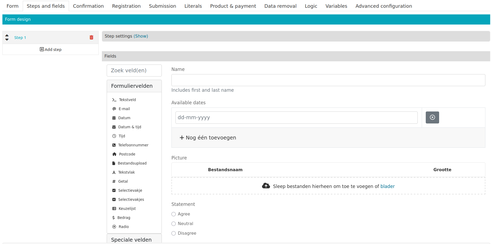
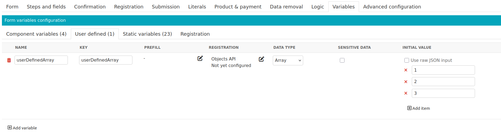

.. _manual_json_schema:

JSON-schema genereren
=====================
Het is mogelijk om een `JSON-schema`_ van een formulier te genereren. Momenteel kan dit voor de Objecten API- of de
Generieke JSON-registratie. Het schema beschrijft de inzendgegevens van alle component- en door de gebruiker
gedefinieerde variabelen, alsof deze via een van deze plugins zijn verzonden. De eigenschapsnamen van de de componenten
worden als sleutel gebruikt in de ``properties`` van het schema. Voor componenten worden de volgende
configuratieopties (indien gespecificeerd) opgenomen in het schema:

 - Label
 - Beschrijving
 - Validatieregels, bijvoorbeeld maximale lengte of een regex-patroon

Hoe werkt het
-------------
Om een JSON-schema van een formulier te genereren, ga naar het tabblad **Registratie** en configureer een
:ref:`Objecten API- <configuration_registration_objects>` of
:ref:`Generieke JSON-registratie <configuration_registration_objects>`. De fieldset van de plugin bevat een knop
waarmee een venster kan worden geopend. Hierin is het gegenereerde schema beschikbaar in een JSON-editor.

.. note:: Om te zorgen dat het schema het formulier nauwkeurig beschrijft, is het belangrijk dat de geconfigureerde
   registratieopties, componenten en variabelen eerst zijn opgeslagen. Sla het complete formulier dus altijd op
   vóór het genereren van een schema.

Voorbeeld
---------

De stap en gebruikersvariabelen zijn op de volgende manier geconfigureerd:

Voor de Objecten API-registratie resulteert dit in het volgende schema:

.. code-block:: json

    {
      "$schema": "https://json-schema.org/draft/2020-12/schema",
      "type": "object",
      "properties": {
        "lijst": {
          "type": "array",
          "title": "lijst"
        },
        "naam": {
          "title": "Naam",
          "type": "string",
          "pattern": "^[\\w\\s\\-]+$",
          "maxLength": 50,
          "description": "Voor- en achternaam"
        },
        "beschikbareDatums": {
          "title": "Beschikbare datums",
          "type": "array",
          "items": {
            "format": "date",
            "type": "string"
          }
        },
        "afbeelding": {
          "title": "Afbeelding",
          "type": "string",
          "oneOf": [
            {"format": "uri"},
            {"pattern": "^$"}
          ]
        },
        "stelling": {
          "title": "Stelling",
          "type": "string",
          "enum": ["mee_eens", "neutraal", "niet_mee_eens", ""]
        }
      },
      "required": [
        "lijst",
        "naam",
        "beschikbareDatums",
        "afbeelding",
        "stelling"
      ],
      "additionalProperties": false
    }

Let op de volgende punten:

 - Het schema van tekstveld ``naam`` bevat een regex-patroon, maximale lengte en een beschrijving. Deze zijn uit de
   configuratie van het component gehaald.
 - Het datumveld ``beschikbareDatums`` kan meerdere waarden bevatten, wat betekent dat het resultaat een lijst van
   datums zal zijn.
 - Als er geen bestand is geüpload naar het veld ``afbeelding``, zal de waarde een lege string zijn. Het bijbehorende
   schema geeft dit aan met het sleutelwoord ``oneOf``.
 - De ingezonden waarde voor het radioveld ``stelling`` zal beperkt zijn tot de waarden (dus niet de labels) van
   vermelde opties en een lege string (als het veld niet is ingevuld). Het bijbehorende schema geeft dit aan met het
   sleutelwoord ``enum``.
 - De items van de gebruikersvariabele ``lijst`` kunnen van elk type zijn, dus het schema beschrijft dit simpelweg als
   een array.

.. _`JSON-schema`: https://json-schema.org/
