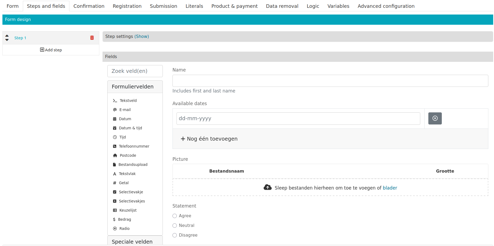
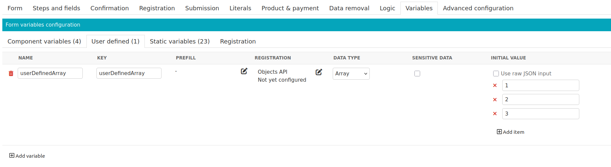

.. _manual_json_schema:

JSON schema generation
======================
It is possible to generate a `JSON schema`_ of a form. Currently, this can be done for the Objects API registration
or Generic JSON registration. The schema describes the submission data of all component and user-defined variables,
as if they were sent through one of those plugins. For components, the following configuration options (if specified)
are included in the schema:

 - Label
 - Description
 - Validation rules, e.g., maximum length or regex pattern

How to
------
To generate a JSON schema of a form, navigate to its **Registration** tab and configure an Objects API
(see :doc:`documentation </configuration/registration/objects>`) or Generic JSON registration
(see :doc:`documentation </configuration/registration/generic-json>`). A button to generate the schema will be present in the
fieldset of the configured plugin. When clicked, it opens a modal with the schema inside a JSON editor where it
can be copied.

.. note:: To get a schema that accurately describes the form, it is important that the configured registration
   options, components, and variables are saved first.

Example
-------

Consider the following step configuration and user-defined variables:

For the Objects API plugin, this will result in the following schema:

.. code-block:: json

    {
      "$schema": "https://json-schema.org/draft/2020-12/schema",
      "type": "object",
      "properties": {
        "userDefinedArray": {
          "type": "array",
          "title": "userDefinedArray"
        },
        "name": {
          "title": "Name",
          "type": "string",
          "pattern": "^[\\w\\s\\-]+$",
          "maxLength": 50,
          "description": "Includes first and last name"
        },
        "availableDates": {
          "title": "Available dates",
          "type": "array",
          "items": {
            "format": "date",
            "type": "string"
          }
        },
        "picture": {
          "title": "Picture",
          "type": "string",
          "oneOf": [
            {"format": "uri"},
            {"pattern": "^$"}
          ]
        },
        "statement": {
          "title": "Statement",
          "type": "string",
          "enum": ["agree", "neutral", "disagree", ""]
        }
      },
      "required": [
        "userDefinedArray",
        "name",
        "availableDates",
        "picture",
        "statement"
      ],
      "additionalProperties": false
    }

Please note a few things:

 - The schema of the ``name`` text field contains a pattern, maximum length, and a description. These correspond with
   the settings specified for this component.
 - The ``availableDates`` date field can contain multiple values, meaning the result will be an array of dates.
 - If no file were to be uploaded to the ``picture`` field, its value will be an empty string. The corresponding schema
   represents this with a ``oneOf`` keyword.
 - The submitted value for the ``statement`` radio component will be limited to the listed options and an empty string
   if it were to be unfilled. The corresponding schema represents this with the ``enum`` keyword.
 - The items of the ``userDefinedArray`` can be of any type, so the schema just describes it as an array.

.. _`JSON Schema`: https://json-schema.org/
