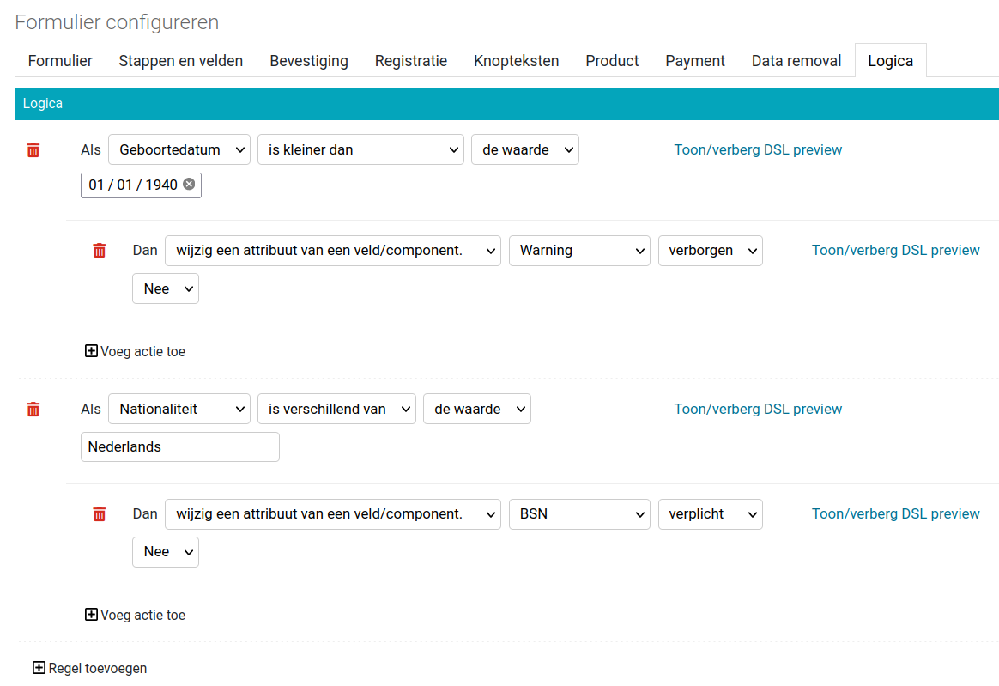

.. _manual_logic:

======================
Dynamische formulieren
======================

Open Formulieren ondersteund krachtige regels en acties die het gedrag of de
inhoud van het formulier aanpassen op basis van ingevoerde waarden door de
gebruiker.

Om te beginnen zijn er 2 termen die hierbij gebruikt worden, te weten:

* **Regels** - Een regel beschrijft de voorwaarden waaraan voldaan moet worden.
* **Acties** - Een actie beschrijft wat er veranderd moet worden in het 
  formulier.

Als een regel slaagt, dan worden de acties die erbij horen uitgevoerd. De 
opbouw is als volgt:

**Als** *<voorwaarde>* (regel)
**dan** *<wijziging>* (actie).

**Voorbeeld**

**Als** [*Gegevens: geslacht*] [*is gelijk aan*] [*de waarde*] ``m``
**dan** [*wijzig de waarde van een veld*] [*Gegevens: Aanhef*] [*de waarde*] 
``de heer``

Bovenstaand voorbeeld wijzigt de waarde van het tekstveld *Aanhef*, in de 
formulierstap *Gegevens*, naar ``de heer`` als het geselecteerde *Geslacht* 
``m`` is.

In het voorbeeld staan een aantal woorden tussen blokhaken ([...]). Hiermee
duiden we in de documentatie aan dat dit keuzevelden zijn. Er zijn namelijk
allerlei mogelijkheden om regels op te stellen en acties uit te voeren.

Afhankelijk van de gekozen keuzevelden komen andere, meer of minder opties 
beschikbaar.

Regels
======

De eerder genoemde **Als** *<voorwaarde>* regel is een kleine abstractie op
een complexere set van onderdelen:

**Als** [*<veld>*] [*<operatie>*] [*<type waarde>*] **<waarde>**

Hieronder staat per onderdeel uitgelegd wat de mogelijkheden zijn, en wat ze 
doen.

* *<veld>* - Een veld uit een van de beschikbare formulierstappen. Voorbeeld:
  [*Gegevens: geslacht*]
* *<operatie>* - Er zijn diverse operaties mogelijk. Niet alle operaties zijn
  mogelijk voor alle *<velden>*:

  * **is gelijk aan** - De waarde van het *<veld>* is hetzelfde als 
    de **<waarde>**
  * **is niet gelijk aan** - De waarde van het *<veld>* is niet 
    hetzelfde als de **<waarde>**
  * **in** - De waarde van het *<veld>* is onderdeel van de 
    **<waarde>**. De *<waarde>* is hier veelal een lijst of een veld dat 
    meerdere waarden kan bevatten.
  * **is groter dan** - Werkt alleen bij datum- en nummer-velden.
  * **is groter dan of gelijk aan** - Werkt alleen bij datum- en nummer-velden.
  * **is kleiner dan** - Werkt alleen bij datum- en nummer-velden.
  * **is kleiner dan of gelijk aan** - Werkt alleen bij datum- en nummer-velden.
* *<type waarde>* - De **waarde** waarop de *<operatie>* uitgevoerd wordt kan
  op verschillende manieren opgegeven of opgehaald worden. U moet daarom eerst
  het type waarde kiezen:

  * **de waarde** - Een handmatig opgegeven waarde.
  * **het veld** - De waarde van een specifiek veld.
  * **de lijst** - Een handmatig opgegeven lijst van waarden.

Acties
======

Nadat een regel is gedefinieerd, kunnen een of meerdere acties worden 
toegevoegd. De acties kunnen het formulier wijzigen afhankelijk van de 
gegevens die de gebruiker invult. Er zijn verschillende acties mogelijk:

* **blokkeer doorgaan naar de volgende stap.** - Doorgaan kan niet meer in 
  het formulier. De knop om naar de volgende stap te gaan is verdwenen.
* **wijzig een attribuut van een veld/component.** - Met deze actie kan:

  * **verplicht** (ja/nee) - Een niet-verplicht veld wordt veranderd in een 
    verplicht veld (of een verplicht veld wordt optioneel).
  * **verborgen** (ja/nee) - Een zichtbaar veld wordt verborgen (of een 
    verborgen veld wordt zichtbaar)
  * **uitgeschakeld** (ja/nee) - Een veld blijft zichtbaar maar kan niet meer
    worden gewijzigd.
* **wijzig de waarde van een veld/component.** - Met deze actie kan de 
  waarde van een *<veld>* worden veranderd naar de waarde van een ander 
  veld of een waarde gekozen door de beheerder.

  * *<veld>* - Het veld dat gewijzigd moet worden.
  * *<type waarde>* - De waarde die op het te wijzigen *<veld>* word ingevuld.

    * **de waarde** - Een handmatig opgegeven waarde.
    * **het veld** - De waarde van een specifiek veld.
* **markeer een stap als niet van toepassing.** - 

  * *<stap>* - De formulierstap die als n.v.t. wordt aangemerkt.

Geavanceerde logica
===================

De regels die we in de beheerinterface kunnen opstellen zijn beperkt qua 
complexiteit. Onder de motorkap wordt echter gebruik gemaakt van `JSON-logic`_
dat erg krachtig is en meer operaties en complexiteit toestaat dan mogelijk is 
met reguliere logica in Open Formulieren. Acties blijven hetzelfde.

Met de link **Toon/verberg DSL weergave** bij reguliere logica wordt de 
JSON-logic achter de regels (en acties) getoond.

We herhalen het voorbeeld dat eerder werd getoond:

**Als** [*Gegevens: geslacht*] [*is gelijk aan*] [*de waarde*] ``m``
**dan** [*wijzig de waarde van een veld*] [*Gegevens: Aanhef*] [*de waarde*] 
``de heer``

De bijbehorende JSON-logic voor de regel (van **Als** tot **dan**) ziet er zo
uit:

.. code:: json

   {
     "==": [
       {
         "var": "geslacht"
       },
       "m"
     ]
   }

Als we bovenstaande zouden plakken in regel bij geavanceerde logica, dan geeft
dat hetzelfde resultaat als de (gebruiksvriendelijkere) regel bij reguliere 
logica.

Hieronder volgen een aantal voorbeelden, die niet mogelijk zijn met reguliere
logica.

.. note::

   Het is belangrijk dat het resultaat van een regel altijd **waar** (``true``)
   of **onwaar** (``false``) teruggeeft. De regel bepaald immers of de actie 
   uitgevoerd moet worden of niet.

Voorbeelden
-----------

Stel, we hebben een formulier met daarin enkele velden. Hieronder staan de 
velden met hun **eigenschapsnaam** en de **waarde** die is ingevuld door de 
gebruiker. De inzendingsgegevens staan ook uitgedruk in *JSON* (het formaat
waar de JSON-logic op werkt).

.. note::

    U kunt op de `JSON-logic`_ website naar **Play with it** gaan om de 
    voorbeelden zelf te proberen:

    1. Kopiëer de JSON code uit het JSON-tabblad hieronder, naar de website in 
       het tekstvak onder **Data**.
    2. Kopiëer de JSON code van een van de voorbeeld regels, naar de website in
       in het tekstvak onder **Rule**
    3. Klik op **Compute** en er verschijnt of de regel waar of onwaar is.

    .. image:: _assets/jsonlogic.png
       :width: 100%

**Voorbeeld formulier**

.. tabs::

   .. tab:: Formulier gegevens

      ========================  ======================  ==============
      Veld                      Eigenschapsnaam         Waarde 
      ========================  ======================  ==============
      Geslacht (tekst)          ``geslacht``            ``m``
      Leeftijd (getal)          ``leeftijd``            ``18``
      Uw inkomen (bedrag)       ``uwInkomen``           ``30000``
      Partner inkomen (bedrag)  ``partnerInkomen``      ``40000``
      ========================  ======================  ==============

   .. tab:: JSON

      .. code:: json

         {
           "geslacht": "m",
           "leeftijd": 18,
           "uwInkomen": 30000,
           "partnerInkomen": 40000
         }

**Voorbeeld 1a**

Geslacht (``geslacht``) is mannelijk (``m``): Waar (``true``).

.. code:: json

   { "==": [{ "var": "geslacht" }, "m"] }

**Voorbeeld 1b**

Geslacht (``geslacht``) is vrouwelijk (``v``): Onwaar (``false``).

.. code:: json

   { "==": [{ "var": "geslacht" }, "v"] }

**Voorbeeld 2**

Geslacht (``geslacht``) is mannelijk (``m``) en leeftijd (``leeftijd``) is 
groter of gelijk aan 18 (``18``): Waar (``true``).

.. code:: json

   { "and" : [
     { "==": [{ "var": "geslacht" }, "m"] },
     { ">=": [{ "var": "leeftijd" }, 18] }
   ] }

**Voorbeeld 3**

Uw inkomen of die van uw partner is hoger dan EUR 35.000: Waar

.. code:: json

   { "or" : [
     { ">=": [{ "var": "uwInkomen" }, 35000] },
     { ">=": [{ "var": "partnerInkomen" }, 35000] }
   ] }

**Voorbeeld 4**

Het inkomen van u en uw partner is samen hoger dan EUR 60.000: Waar

.. code:: json

   { ">=" : [
     { "+": [
       { "var": "uwInkomen" },
       { "var": "partnerInkomen" }
     ]},
     60000
   ] }

**Voorbeeld 5**

U bent mannelijk, 18 jaar of ouder, en het gemiddelde inkomen van u en uw 
partner is hoger dan EUR 35.000: Waar

.. code:: json

   { "and" : [
     { "==": [{ "var": "geslacht" }, "m"]},
     { ">=": [{ "var": "leeftijd" }, 18]},
     { ">=" : [
       {"/": [
         {"+": [
           { "var": "uwInkomen" },
           { "var": "partnerInkomen" }
         ]},
         2
       ]},
       35000
     ] }
   ] }

.. _`JSON-logic`: https://jsonlogic.com/
