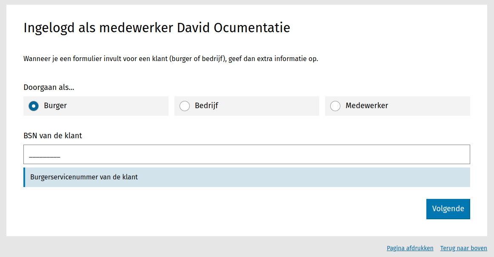

.. _manual_forms_registrator:

==================================
Formulieren invullen voor de klant
==================================

Sommige :ref:`authenticatieplugins <configuration_authentication_index>` laten toe om
als medewerker een formulier in te vullen voor de klant, bijvoorbeeld als deze aan de
balie staat of hulp nodig heeft.

Configuratie door beheerder
===========================

**Pluginconfiguratie**

De plugins dienen hiervoor correct geconfigureerd te zijn door een beheerder. De
volgende plugins ondersteunen deze werkwijze:

* :ref:`Organisatie via OIDC <configuration_authentication_oidc_org>`

**Medewerkerrechten**

Om een formulier in te kunnen vullen voor een klant dient de medewerker voldoende
rechten te hebben. Deze rechten kunnen via de :ref:`beheerinterface <manual_accounts>`
ingesteld worden.

Werkwijze
=========

Navigeer naar de publieke formulierpagina, bijvoorbeeld via het formulierenoverzicht
in de :ref:`beheeromgeving <manual_forms_basics>`.

.. note:: Het kan handig zijn om in uw eigen intranetomgeving een verzameling van
   links naar formulieren bij te houden waarvoor deze werkwijze vaak nodig is, of voor
   medewerkers die geen formulierbouwerrechten hebben.

Bij het starten van het formulier dient u een inlogoptie te kiezen om als medewerker
in te loggen.

Vervolgens komt u op een tussenscherm met drie keuzes:

* **Doorgaan als burger**: u dient het Burgerservicenummer van de klant op te geven.
  Vervolgens werkt voorinvullen en registratie van de formuliergegevens alsof de klant
  zelf ingelogd was (met DigiD bijvoorbeeld)

* **Doorgaan als bedrijf**: u dient het Kamer van Koophandelnummer van de klant op te
  geven. Vervolgens werkt voorinvullen en registratie van de formuliergegevens alsof de
  klant zelf ingelogd was (met eHerkenning/eIDAS bijvoorbeeld)

* **Doorgaan als medewerker**: u hoeft geen extra gegevens op te voeren. De inzending
  van het formulier wordt aan uw medewerkersgegevens gekoppeld. Dit kan handig zijn voor
  interne formulieren binnen uw organisatie.

Vervolgens vult u zoals normaal het formulier verder in.

Bij het registreren van de formuliergegevens wordt de klant als aanvrager/initiator
geregistreerd en uw medewerkersgegevens worden als meta-informatie vastgelegd.
