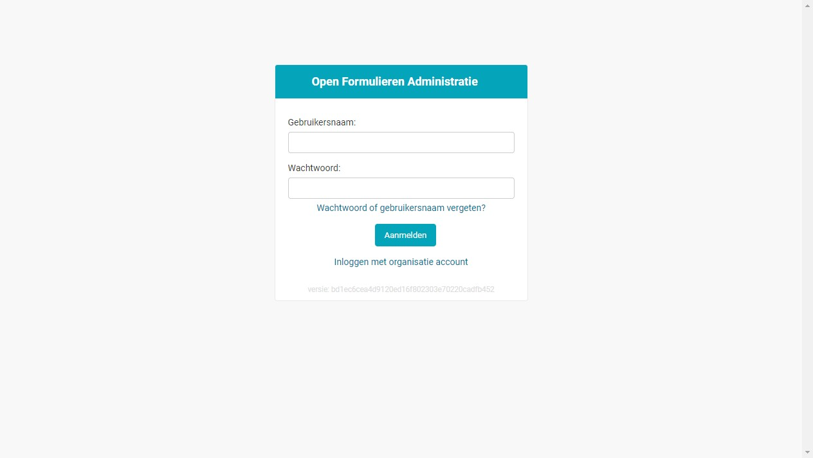
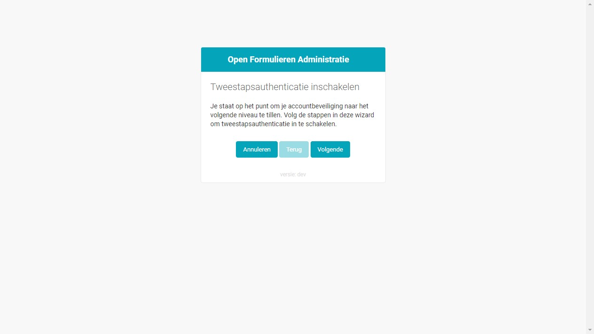
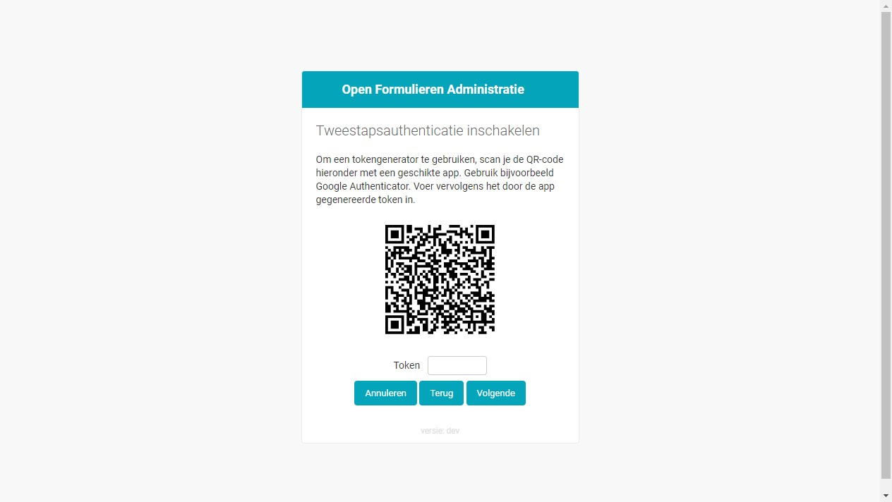
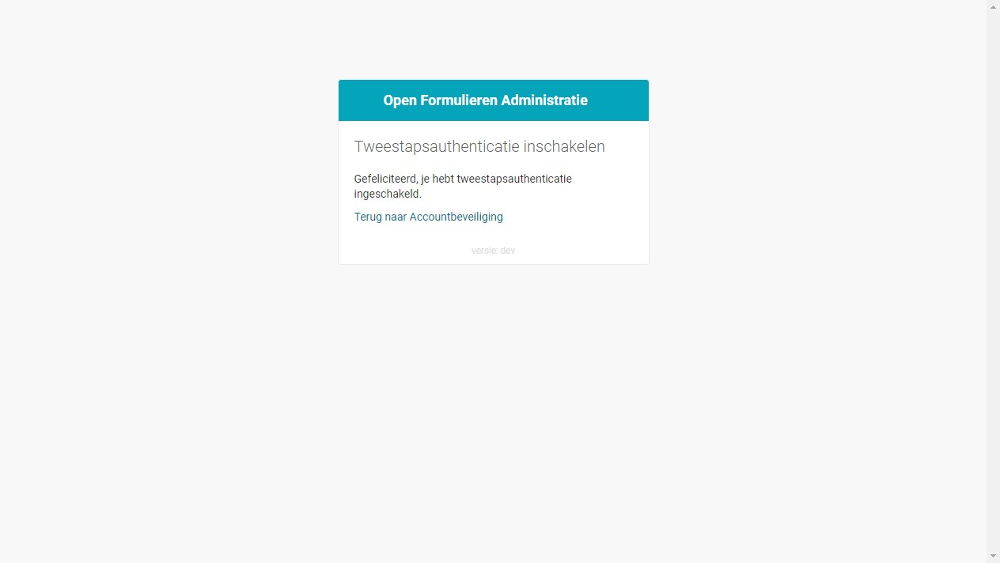
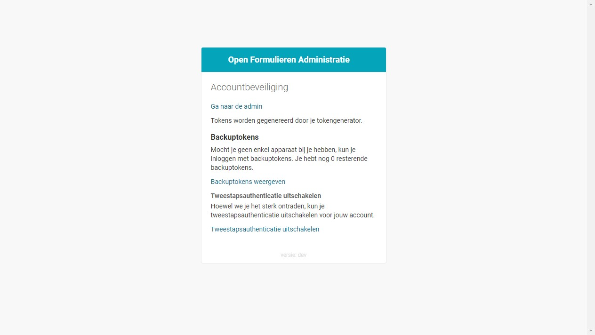
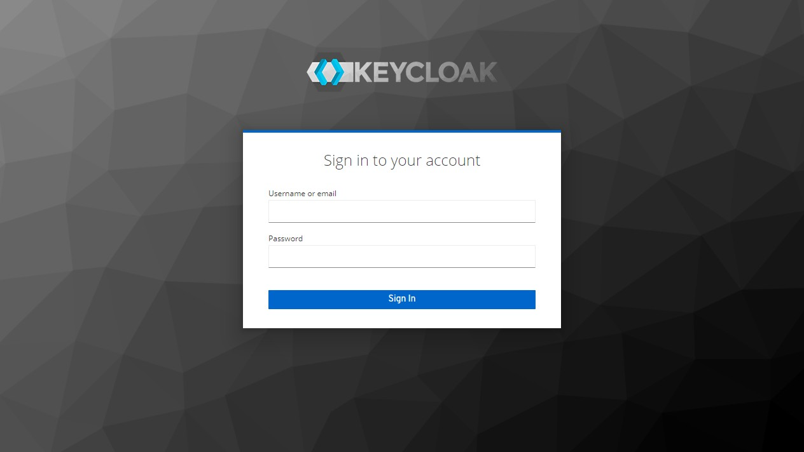
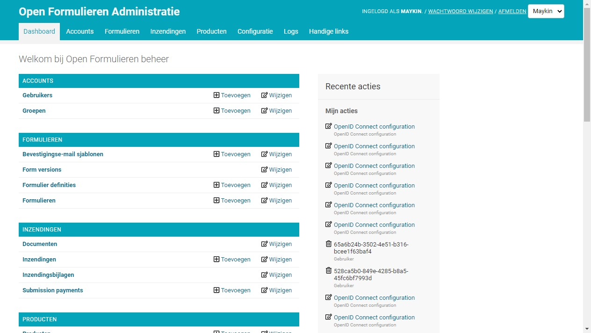

===========
Aan de slag
===========

Om te beginnen met Open Formulieren dient u in te loggen met een account. U 
kunt op 2 verschillende manieren inloggen:

* Gebruik een **lokaal account** indien u *geen* algemeen organisatie account 
  heeft waarmee u op meerdere applicaties inlogt.
* Gebruik een **organisatie account** indien u gebruik wilt maken van Single 
  Sign On (SSO), zoals Microsoft Azure AD.

Inloggen met lokaal account
===========================

Om in te loggen met een lokaal account vult u uw **gebruikersnaam** en 
**wachtwoord** in. Vervolgens klikt u op **Aanmelden**.

.. note::
    
    Als u nog geen *tweestapsauthenticatie* heeft ingesteld, zult u deze eerst 
    moeten :ref:`instellen <instellen>`.

U wordt gevraagd om een **Token**. Open uw *authenticator app* en vul het 
bijbehorende token in. Klik op **Volgende** om de :ref:`beheeromgeving` te 
komen.

.. _`instellen`:

Tweestapsauthenticatie instellen
--------------------------------

Als u nog niet eerder tweestapsauthenticatie heeft ingesteld, verschijnt 
onderstaande melding.

Om tweestapsauthenticatie in te stellen heeft u een mobiele telefoon nodig met 
daarop een *authenticator app* geïnstalleerd. Dit is bijvoorbeeld de 
`Microsoft Authenticator`_ of `Google Authenticator`_.

.. _`Microsoft Authenticator`: https://play.google.com/store/apps/details?id=com.azure.authenticator
.. _`Google Authenticator`: https://play.google.com/store/apps/details?id=com.google.android.apps.authenticator2

1. Klik **Volgende** om te beginnen met instellen.
2. Scan met uw *authenticator app* de QR code op de website, om Open Formulieren
   toe te voegen. Als het goed is komt een token in beeld van 6 tekens, die elke
   30 seconden wijzigt.
3. Vul op de website het **Token** in dat wordt weergegeven in de 
   *authenticator app* en klik op **Volgende**.

U heeft tweestapsauthenticatie nu ingesteld. Als u uw *authenticator app* 
verliest, kunt u niet meer inloggen. Om deze reden worden er zogenaamde 
*backuptokens* aangemaakt. Met deze *backuptokens*  kunt u uw account 
herstellen.

4. Klik op **Terug naar Accountbeveiliging**.
5. Klik op **Genereer backuptokens** en bewaar de tokens op een veilige plaats.
6. Klik op **Terug naar Accountbeveiliging** en vervolgens op **Ga naar de 
   admin**

U bent nu in de :ref:`beheeromgeving`.

Inloggen met organisatie account
================================

Om in te loggen met een organisatie account, hoeft geen gebruikersnaam of 
wachtwoord in te vullen. U klikt u direct op de link **Inloggen met organisatie 
account**. 

Het verdere inlog proces is afhankelijk van uw organisatie instellingen. Na
inloggen komt u in de :ref:`beheeromgeving`.

Wachtwoord vergeten
===================

Als u uw wachtwoord bent vergeten, kunt u uw wachtwoord opnieuw instellen.

1. Op het inlogscherm, klik op de link **Wachtwoord of gebruikersnaam 
   vergeten?**
2. Vul uw **E-mailadres** in en klik op **Mijn wachtwoord opnieuw instellen**.
3. U ontvangt een e-mail met daarin een link om uw wachtwoord opnieuw in te 
   stellen. Controleer alstublieft uw *spambox* als u binnen enkele minuten geen
   e-mail heeft ontvangen.
4. Na het aanklikken kunt de instructies op het scherm volgen.

.. image:: _assets/password_reset.png

.. _`beheeromgeving`:

Beheeromgeving
==============

De beheeromgeving opent op het dashboard.

.. note::
    
    Afhankelijk van uw rechten, ziet u meer of minder (menu) items dan mogelijk 
    worden getoond in de afbeelding.

Navigeren
---------

Bovenin ziet u het **menu**. Als u met de muis over de menu items navigeert,
opent het **submenu** met daarin meer submenu items. Door met de linkermuisknop
te klikken op een submenu item, opent het desbetreffende scherm.

Op het dashboard staan precies dezelfde items als in het menu, maar er staan 
vaak directe acties achter, zoals **Toevoegen** en **Wijzigen**.

Uitloggen
---------

Klik rechtsbovenin op de link **Afmelden**. U wordt hierbij uitgelogd van Open 
Formulieren. Als u ingelogd bent met een organisatie account, wordt u daar 
*niet* uitgelogd.

Wisselen tussen klanten
-----------------------

Beheert uw organisatie meerdere klanten, dan kunt u eenvoudig wisselen tussen
Open Formulieren van verschillende klanten.

Klik rechtsbovenin op de *puldown* en selecteer naar welke klant omgeving van
Open Formulieren wilt navigeren. Afhankelijk van de configuratie moet u daar
opnieuw inloggen.

Recente acties
--------------

Op het dashboard staat een kolom met recente acties. Dit zijn de acties die
u recent heeft uitgevoerd.

Wachtwoord wijzigen
-------------------

.. note::

    Dit werkt alleen voor lokale accounts. Als u inlogt met een organisatie 
    account is deze optie niet beschikbaar.

Klik rechtsbovenin op de link **Wachtwoord wijzigen**. U kunt in het navolgende
scherm uw wachtwoord wijzigen.
