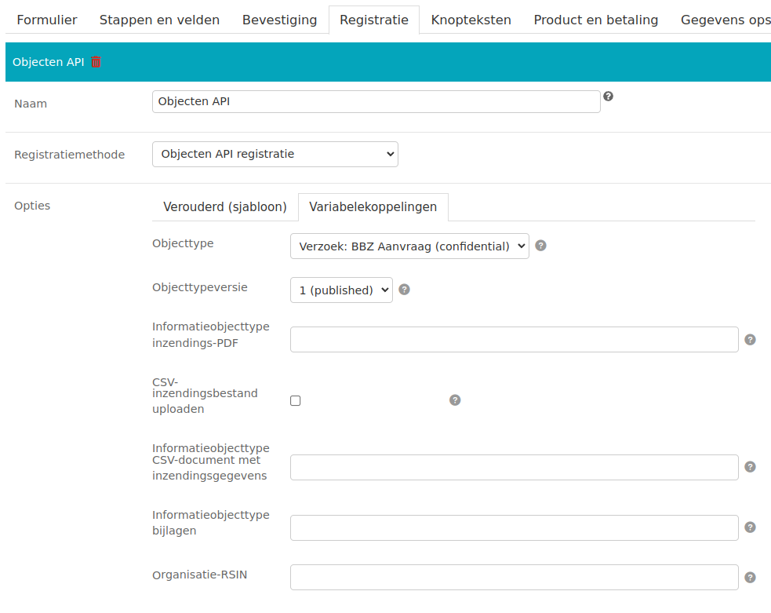
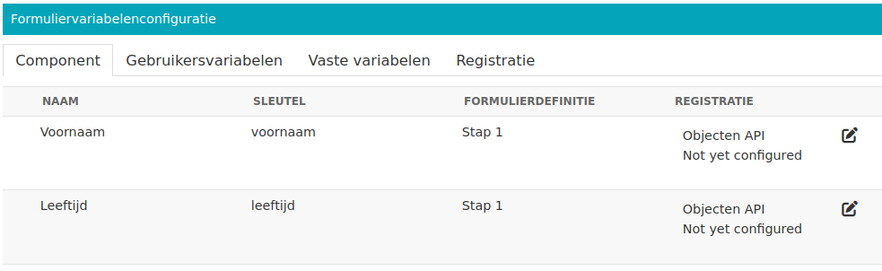
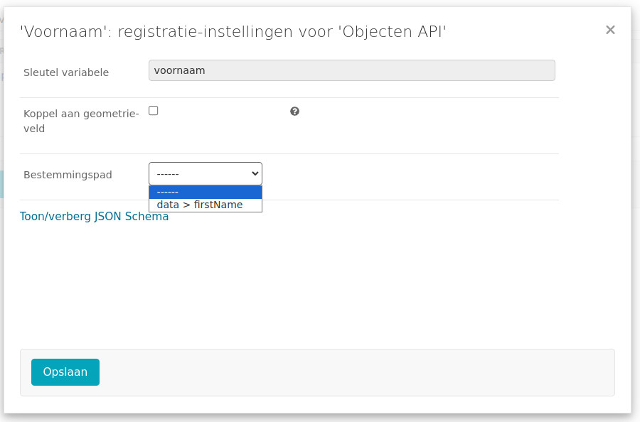
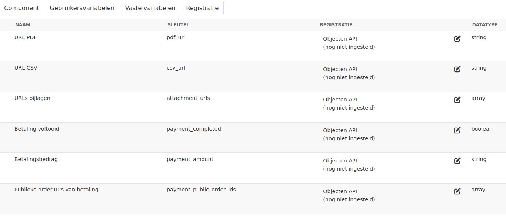

.. _manual_registration_objects_api:

============
Objecten API
============

Met de Objecten API-plugin kunnen inzendingen als "object" in een externe datalaag
duurzaam geregistreerd worden. Deze data is vervolgens beschikbaar in het
behandelproces.

.. note:: De functioneel beheerder dient een aantal
   :ref:`koppelingen <configuration_registration_objects>` in te stellen om deze plugin
   te kunnen gebruiken. Let ook op de
   :ref:`adviezen (Engels) <configuration_registration_objects_objecttype_tips>` voor
   objecttypedefinities.

Er zijn twee mogelijke manieren om de Objecten API in te zetten:

* :ref:`manual_registration_objects_api_variables` (aangeraden)
* :ref:`manual_registration_objects_api_templates` (verouderd)

Deze worden hieronder toegelicht.

.. _manual_registration_objects_api_variables:

Variabelekoppelingen
====================

.. versionadded:: 2.6.0

    Deze methode is nieuw sinds Open Formulieren 2.6 en biedt een robuustere manier van
    werken. We raden sterk aan om enkel deze methode te gebruiken.

De variabelekoppelingenconfiguratie laat toe om aan strikte objecttypedefinities te
voldoen. Deze worden typisch ingericht als "contract" tussen het formulier en de
afhandelapplicatie. Hiermee is de integratie een stuk robuuster en kan je makkelijker
het formulier aanpassen/herorganiseren zonder dat de afhandelapplicatie hierdoor
aanpassingen moet maken.

**Mechanisme**

* Elk formulierveld leidt tot een formuliervariabele
* Na selectie van het relevante objecttype "kent" Open Formulieren het contract
* Formuliervariabelen koppel je vervolgens aan bestemmingen die beschreven staan in het
  contract
* Tijdens het registeren voldoen de gegevens automatisch aan het beschreven contract
  en heeft de afhandelapplicatie inhoudelijk begrip van de gegevens

Voorbeeld
---------

**Objecttype**

Voor dit voorbeeld gaan we uit van een objecttype waarin drie gegevens vastgelegd worden:

* betaling voltooid (ja/nee)
* groep "data"

    * voornaam (tekst)
    * leeftijd (getal, aantal jaren)

.. note:: Technisch worden deze gegevens met JSON Schema gemodelleerd, en dat ziet er
   dan zo uit:

   .. code-block:: json

     {
       "$schema": "http://json-schema.org/draft-07/schema#",
       "type": "object",
       "properties": {
         "payment_completed": {"type": "boolean"},
         "data": {
           "type": "object",
           "properties": {
             "firstName": {"type": "string"},
             "age": {"type": "integer"}
           }
         }
       }
     }

**Formulier**

We gaan uit van een formulier met één stap. In deze stap zijn twee velden gedefinieerd:

* Een tekstveld met de sleutel ``voornaam``
* Een nummerveld met de sleutel ``leeftijd``

Merk op dat de velden Nederlandse sleutels hebben en het objecttype Engelse sleutels
gebruikt (voornaam vs. firstName, leeftijd vs. age).

**Registratiemethode selecteren**

Op de **Registratie** tab selecteer je als registratiemethode "Objecten API registratie".

Vervolgens kies je de tab **Variabelekoppelingen**, waar je het objecttype kan selecteren
in het keuzemenu. Na selectie van de het objecttype kan je de gewenste versie van het
objecttype selecteren.

De overige velden gebruiken de globale instellingen (indien deze beschikbaar zijn).

**Variabelen koppelen**

Navigeer in het formulier naar de **Variabelen** tab. Deze ziet er dan ongeveer uit als:

(de screenshot toont enkel de relevante informatie, in de applicatie zijn extra kolommen
zichtbaar).

Elke variabele koppel je apart aan een bestemming uit het objecttype. Klik hiervoor het
potloodicoon aan. Er opent een pop-up:

In het keuzemenu voor de bestemmingspaden worden enkel opties getoond die compatibel
zijn met de variabele - omdat de "voornaam" een tekstveld is, krijg je dus de optie
``data > age`` niet te zien, want dit is een numerieke waarde.

Klik na het selecteren van een bestemmingspad op **Opslaan**, en voer deze stap uit
voor elke formuliervariabele.

**Extra variabelen**

Naast formuliervariabelen afkomstig uit formuliervelden zijn er nog drie andere soorten
variabelen:

* Gebruikersvariabelen, deze kan je zelf definiëren
* Vaste variabelen, die altijd beschikbaar zijn voor elk formulier
* Registratievariabelen die enkel gedurendende de registratiefase (ná het inzenden)
  beschikbaar zijn. Registratievariabelen zijn specifiek voor de geselecteerde
  registratiemethode(n).

Om de "betaling voltooid" (``payment_completed``) waarde weg te schrijven bij registratie
navigeer je dus naar de tab **Registratie** binnen de **Variabelen**, en daar stel je
vervolgens de variabele "Betaling voltooid" in op dezelfde manier als andere
formuliervariabelen.

**Productaanvraag**

In de sjabloon-configuratie is er een veld om het productaanvraagtype in te stellen. Dit
veld bestaat in de variabelekoppelingen niet meer.

Je kan wel eenvoudig hetzelfde gedrag bereiken:

#. Navigeer naar de **Variabelen** tab
#. Binnen de variabelen tab, selecteer de **Gebruikersvariabelen** tab
#. Voeg een variabele toe met de naam ``Productaanvraagtype``, datatype "Tekst (string)"
   en beginwaarde de naam van het productaanvraagtype (bijvoorbeeld "terugbelnotitie")

Je kan dan de registratie instellen, en als bestemmingspad kies je dan ``data > type``.

**Geometrie**

De Objecten API ondersteunt ook het vastleggen van een geometrie. Dit is een speciaal
attribuut dat niet beschikbaar is in de keuzelijst met bestemmingspaden.

Je kan echter een variabele koppelen via het selectievakje "Koppel aan geometrieveld".

.. warning:: Merk op dat je slechts één variabele aan het geometrieveld kan koppelen.

.. _manual_registration_objects_api_templates:

Op basis van sjablonen
======================

.. warning:: Deze methode is verouderd en foutgevoelig.

Zie de rubriek in de :ref:`sjabloondocumentatie <objecten_api_registratie>`.

