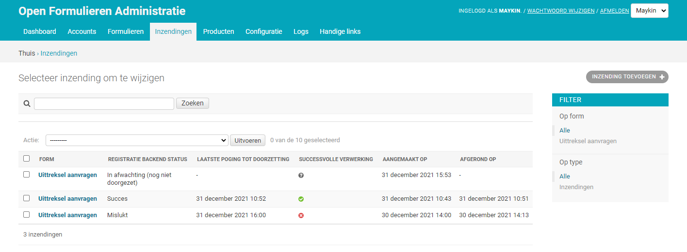
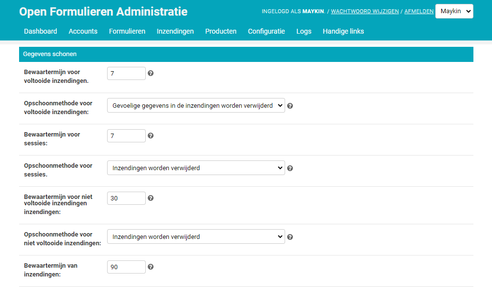

===========
Inzendingen
===========

Elk formulier dat wordt gestart, start tevens een inzending. In de inzending
wordt alle informatie opgeslagen van het formulier voor zover dat tot op dat
moment is ingevuld. Velden op een formulier worden per stap opgeslagen.

Zodra een gebruiker een inzending voltooit kan de inzending (inhoudelijk) niet
meer aangepast worden.

Raadplegen
==========

U kunt inzendingen eenvoudig raadplegen:

1. Navigeer naar **Inzendingen** > **Inzendingen**
2. Standaard ziet u alleen voltooide inzendingen. Indien u ook niet afgeronde 
   formulieren en actieve sessies wilt zien kunt u het filter aanpassen.
3. U kunt op een inzending klikken om de details te bekijken.

Om te zien wat er met een formulier is gebeurd, kunt u het logboek raadplegen
onderaan de pagina van de betreffende inzending.

Registratiesysteem
==================

Elke inzending **kan** worden doorgezet naar een achterliggend 
registratiesysteem. Er zijn verschillende 
:ref:`plugins <configuration_registration_index>` beschikbaar om inzendingen
door te zetten naar specifieke registratiesystemen.

Als er geen registratiesysteem is gekozen, dan zijn inzendingen alleen te 
raadplegen via de Open Formulieren 
:ref:`API <provide access to the Open Forms API>` en 
:ref:`beheerinterface <beheeromgeving>`. Als een inzending is doorgezet naar
een registratiesysteem blijft de inzending ook in Open Formulieren 
beschikbaar tot het moment van schoning.

**Handleidingen per plugin**

.. toctree::
   :maxdepth: 1

   registration/objects-api

Instellingen
============

Opschonen
---------

Inzendingen worden regelmatig geschoond. Er is een aantal instellingen die
de manier en periode van opschoning beïnvloeden. Zo kunnen inzendingen na
enige tijd volledig verwijderd worden of kan alleen gevoelige informatie uit 
een inzending verwijderd worden.

.. warning::

    Verwijderde inzendingen zijn ook echt verwijderd. Deze kunnen niet worden
    teruggehaald omwille van privacy en archiveringswetgeving.

Referentienummers
-----------------

Elke inzending krijgt een referentienummer. De klant die het formulier instuurt kan met
deze referentie contact opnemen met de organisatie om informatie op te vragen of
problemen te melden.

Afhankelijk van de (formulier)instellingen wordt dit nummer door Open Formulieren of
door een externe registratieplugin gegenereerd. Als de generatie van de externe plugin
faalt, dan genereert Open Formulieren zelf een referentie zodat de klant altijd iets van
houvast heeft.

In de **Admin** > **Configuratie** > **Algemene configuratie** kan de beheerder onder
"Inzendingen" het sjabloon voor de referentienummers instellen. Het standaardsjabloon
is ``OF-{uid}``.

In dit sjabloon kan je alle alfanumerieke karakters gebruiken, de karakters ``-``, ``_``,
``/``, ``.`` en de speciale instructies:

* ``{uid}`` (verplicht) - het unieke nummer, bestaande uit hoofdletters en cijfers
* ``{year}`` - huidige jaar, in het formaat ``JJJJ``, bijvoorbeeld 2026
